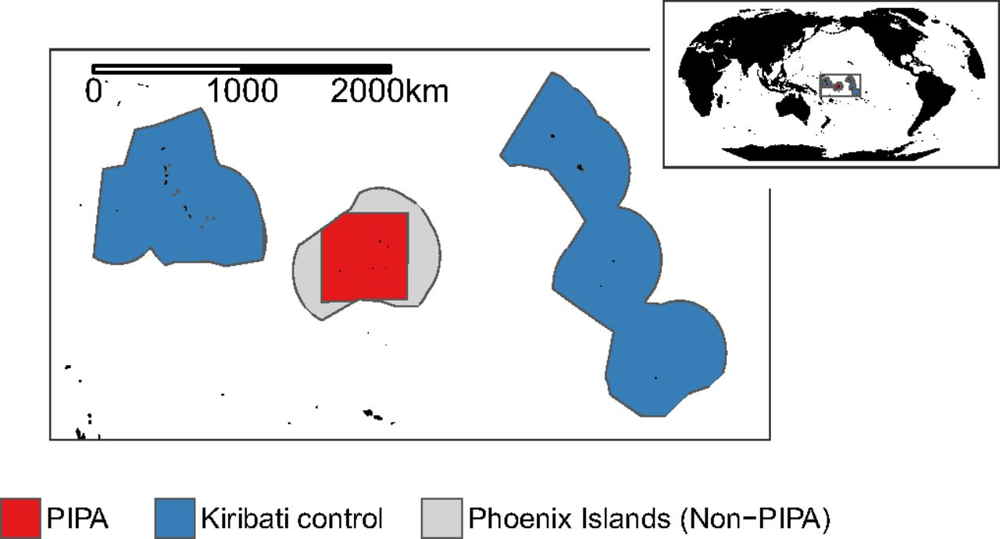
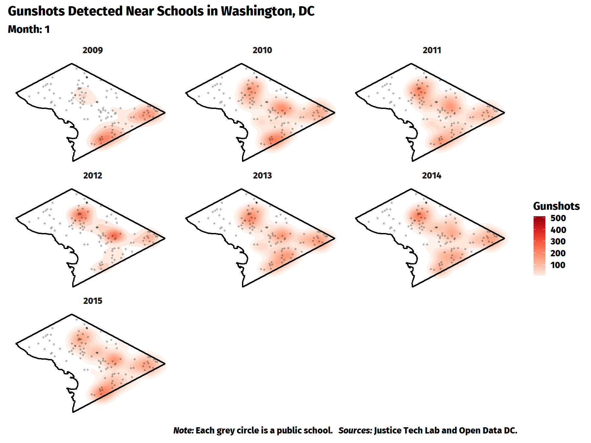

class: inverse, middle

```{r Setup, include = F}
options(htmltools.dir.version = FALSE)
library(pacman)
p_load(ggthemes, viridis, knitr, dslabs, gapminder, extrafont, Ecdat, wooldridge, tidyverse, magrittr)
# Define colors
red_pink <- "#e64173"
met_slate <- "#272822" 
turquoise <- "#20B2AA"
orange <- "#FFA500"
red <- "#fb6107"
blue <- "#2b59c3"
green <- "#8bb174"
grey_light <- "grey70"
grey_mid <- "grey50"
grey_dark <- "grey20"
purple <- "#6A5ACD"
slate <- "#314f4f"
# Notes directory
dir_slides <- "~/Lectures/01-Intro"
# Knitr options
opts_chunk$set(
  comment = "#>",
  fig.align = "center",
  fig.height = 7,
  fig.width = 10.5,
  warning = F,
  message = F
)  
opts_chunk$set(dev = "svg")
options(device = function(file, width, height) {
  svg(tempfile(), width = width, height = height)
})
options(crayon.enabled = F)
options(knitr.table.format = "html")
```

```{css, echo = F, eval = F}
@media print {
  .has-continuation {
    display: block !important;
  }
}
```

# Prologue

---
# Who am I? 

[**Philip Economides**](https://philip-economides.com)

- Doctoral student in economics

- TA in 'metrics EC320 (UG), EC423/EC523 (UG/MSc) and EC607 (PhD)

- Former RA at ESRI/Trinity College Dublin, Ireland

- Focus: International Economics, Applied Econometrics

--

Where can you find me?

- Office: 520 PLC
- Office hours: Tuesday 15:00-16:00, Friday 10:30-11:30, or by appointment
- Email: [.mono[peconomi@uoregon.edu]](mailto:peconomi@uoregon.edu) **(use EC 320 in the subject line)**

---

### Teaching Assistants


---

layout: true

# What will we do?

---

<br>

We will use two textbooks:

* Introduction to Econometrics, 5th Ed. by C. Dougherty .hi-pink[(ItE)]

* Mastering 'Metrics: the Path from Cause to Effect, by Angrist & Pischke .hi-pink[(MM)]

--

Lectures are not a substitute for these resources, but rather the finishing touch on solidifying your knowledge.

Read through the prescribed readings listed in the Tentative Schedule of the syllabus .hi-pink[before each lecture].

---

## Coursework

* .hi-slate[W1 & W2:] Statistics Review + Fundamental Problem
* .hi-slate[W3:] Logic of Regressions
* .hi-slate[W4:] SLR - Estimation
* .hi-slate[W5:] SLR - Classical Assumptions
* .hi-slate[W6:] .hi-pink[Midterm], SLR - Inference
* .hi-slate[W7:] MLR - Estimation & Inferece
* .hi-slate[W8:] Non-linear & Qualitative variables
* .hi-slate[W9:] Interation terms & Model Specifications
* .hi-slate[W10:] Heteroskedasticity & .hi-pink[Finals] Review

Content will be available on Canvas. If you wish to download them faster, see the course [Github](https://github.com/peconomi/EC320_Econometrics) page.

---

<br>

## Grade

* 25% - Problem Sets (5pp each)

* 10% - Quizzes (5pp each)

* 20% - Midterm Exam

* 10% - Data Assignment

* 35% - Final Exam

---

<br>

## Labs

Develop practical skills based on the material we cover.

Lab sessions will teach you how to conduct data cleaning, visualize data and produce regression analysis based on simulations and empirical questions. 

Crucial for computational portions of assignments.

---

layout: true

# Good Classroom Citizenship

---

<br>

As you all know very well by now:

* Wear your mask and make sure it fits you well
* Stay home if you’re sick
* Get to know your neighbors in class, let them know if positive
* Watch for signs and symptoms with the daily symptom self check
* Wash your hands frequently or use hand sanitizer
* Complete the UO COVID-19 case and contact reporting form if you test positive or are a close contact of someone who tests positive. 

UO Corona Corps: 541-346-2292; Careteam@uoregon.edu

---

layout: true

# Motivation

---

## Why study econometrics?

1. Develop __skills that employers value__.

--

1. Cultivate __healthy skepticism__.

--

1. Learn about the world using __data__.

???

Government agencies and private firms rely on data to make informed decisions. Requires people who can clean and analyze data, create informative visualizations, and communicate results. .mono[R] facilitates these tasks.

When should we trust the findings of a study? Junk science abounds. Blind faith in science and science denialism are harmful. Econometrics gives us a way to evaluate the quality of evidence. Makes us better citizens.

Historically, high quality data were scarce. Econometricians had to think rigorously and creatively about how to learn from less than ideal data. Result: proliferation of robust methods with falsifiable assumptions.

---

## Why study econometrics?

### Provide answers to important questions

--

- Do minimum wage policies __reduce poverty__?

--

- Does the death penalty __deter violent crime__?

--

- Does recreational marijuana __cross state lines__?

--

- Are recessions __good for your health__?

--

- How will global warming __affect the economy__?

--

- What __explains the gender pay gap__?

--

- Does corruption __impact exporting prospects in developing countries__?

---

layout: true

# Econometrics

---

Most econometric inquiry concerns one of two distinct goals:

1. .hi-purple[Prediction:] Accurately .purple[predict] or .purple[forecast] an outcome given a set of predictors. .purple[Given what we know about] $\color{#6A5ACD}{x}$.purple[, what values do we expect] $\color{#6A5ACD}{y}$ .purple[to take?]

1. .hi-green[Causal identification:] .green[Estimate] the effect of an intervention on an outcome. .green[How does] $\color{#007935}{y}$ .green[change when we change] $\color{#007935}{x}$.green[?]

???

__Prediction examples__
Netflix uses information on users and their choices to provide individualized movie recommendations.
Some states use data on defendants to predict pretrial flight risk.
The Federal Reserve uses economic data to forecast inflation, unemployment, and GDP.

__Causal examples__
Pharmaceutical companies run clinical trials to determine whether new medicines reduce symptoms or cause side effects.
Tech companies use __A/B testing__ to improve user experience (and increase profit).
Economists use __natural experiments__ to better understand how people respond to incentives.

--

The main focus of EC 320 and EC 421 is causal identification.

--

- But...both rely on a common set of statistical techniques.

--

- For those interested, Professor Tim Duy teaches forecasting (EC 422) this same term.

---

## Not all relationships are causal

```{R, spurious, echo = F, dev = "svg", warning=FALSE, message=FALSE, fig.height = 6}
cheese <- c(29.8,30.1,30.5,30.6,31.3,31.7,32.6,33.1,32.7,32.8)
bed_ded <- c(327,456,509,497,596,573,661,741,809,717)

df <- data.frame(cheese=cheese, 
                 bed_ded=bed_ded)

ggplot(df, aes(cheese, bed_ded)) +
  geom_point(size = 4, color = "darkslategray") +
  geom_smooth(method = "lm", se = FALSE, color = red_pink) +
  xlab("Per Capita Cheese Consumption (lbs.)") +
  ylab("Death by bedsheet tangling") + 
  theme_pander(base_size = 17, base_family = "FiraSans-Regular", fc = met_slate)
```

---

## Correlation vs. Causation

Common refrain: _"Correlation doesn't necessarily imply causation!"_

- __Q:__ Why might correlation fail to describe a causal relationship?

--

- __A:__ Omitted-variables bias, selection bias, simultaneity, reverse causality.

--

Correlation can imply causation.

- Requires strong assumptions.

--

- **Real life often violates these assumptions!**

- **Solutions:** Conduct an experiment or find a natural experiment.

---

### Example: *Blue Paradox*

[Recent study](https://www.pnas.org/content/116/12/5319) by UO economist [Grant McDermott](https://grantmcdermott.com) and coauthors.

**Question:** Do commercial fishers preempt fishing bans by increasing their fishing effort before the bans go into effect?

**Motivation**

- Recent conservation efforts seek to preserve aquatic habitat and increase fish stocks.
- Policy lever: Restrict fishing activity in marine protected areas.
- Concern: Preemptive behavior could *decrease* fish stocks.

--

**Data:**  Vessel-level data on fishing effort/intensity.

---
### Example: *Blue Paradox*

**Natural Experiment**

Phoenix Islands Protected Area (PIPA) 

- First mentioned on 1 September 2014; implemented 1 January 2015.
- *Treatment group:* PIPA.
- *Control group:* Outlying Kiribati islands. 

---

### Example: *Blue Paradox*

**Natural Experiment**

Measure the causal effect of the fishing ban by comparing fishing effort in treatment and control regions, before-and-after PIPA.

- A *difference-in-differences* comparison.
- .hi[Assumption:] .pink[Parallel trends.] If we believe this assumption, then the observed change supports a causal interpretation. If not, then the change could reflect other factors and thus fail to isolate the causal effect of the ban.

---

### Example: *Blue Paradox*

**Results**

```{r, echo=FALSE, out.width="95%", fig.align='center'}



```


---

### Example: *Blue Paradox*

**Discussion**

Results provide causal evidence that commercial fishers engage in preemptive behavior in response to conservation policy changes.

Results are *consistent* with economic theory, but *cannot prove* that the theory is correct.

- **Science cannot prove anything.**
- Science can .hi[falsify or reject] existing hypotheses or .hi[corroborate] existing evidence.

---

<br>

Also...the causal statement rests on a critical assumption.

- Cannot prove that the assumption is true, but can falsify it.
- Failure to falsify $\neq$ assumption is true.

---

layout: true

# R

---

## What is .mono[R]?

According to the [.mono[R] project website](https://www.r-project.org),

> .mono[R] is a free software environment for statistical computing and graphics. It compiles and runs on a wide variety of UNIX platforms, Windows and MacOS.

--

What does that mean?

- .mono[R] is __free__ and __open source__.

- .mono[R] executes a variety of statistical techniques and produces beautiful graphs.

- .mono[R] has a vibrant, thriving online community (see [stack overflow](https://stackoverflow.com/questions/tagged/r)).


---

## Why are we using .mono[R]?

1. .mono[R] is __free__.

--

1. __.mono[R] is popular__ among economists, political scientists, psychologists, sociologists, geographers, anthropologists, biologists, data scientists, and statisticians.

--

1. __Employers prefer .mono[R]__ over most competing software environments.

--

1. .mono[R] can __adapt to nearly any task__: 'metrics, spatial data analysis, machine learning, web scraping, data cleaning, website building, teaching.

---

```{R, statistical languages, echo = F, dev = "svg"}
# The popularity data
pop_df <- data.frame(
  lang = c("SQL", "Python", "R", "SAS", "Matlab", "SPSS", "Stata"),
  n_jobs = c(25694, 27560, 13506, 7786, 3449, 2694, 1303),
  free = c(T, T, T, F, F, F, F)
)
pop_df %<>% mutate(lang = lang %>% factor(ordered = T))
# Plot it
ggplot(data = pop_df, aes(x = lang, y = n_jobs, fill = free)) +
geom_col() +
geom_hline(yintercept = 0) +
aes(x = reorder(lang, -n_jobs), fill = reorder(free, -free)) +
xlab("Statistical language") +
scale_y_continuous(label = scales::comma) +
ylab("Number of jobs") +
ggtitle(
  "Comparing statistical languages",
  subtitle = "Number of job postings on Indeed.com, 2019/07/17"
) +
scale_fill_manual(
  "Free?",
  labels = c("True", "False"),
  values = c(red_pink, "darkslategray")
) +
theme_pander(base_size = 17, base_family = "Fira Sans", fc = met_slate) +
theme(legend.position = "bottom")
```

---
layout: false
class: inverse, middle

# .mono[R] + [Examples]

---

# .mono[R] + Regression

```{R}
# A simple regression
{{fit <- lm(mpg ~ 1 + wt, data = mtcars)}}
# Show the coefficients
coef(summary(fit))
# A nice, clear table
library(broom)
tidy(fit)
```

---

# .mono[R] + Plotting (w/ .mono[plot])

```{r, echo = F, dev = "svg"}
# Load packages with dataset
p_load(gapminder)
# Create dataset
plot(
  x = gapminder$gdpPercap, y = gapminder$lifeExp,
  xlab = "GDP per capita", ylab = "Life Expectancy"
)
```

---

# .mono[R] + Plotting (w/ .mono[plot])

```{r, eval = F}
# Load packages with dataset
p_load(gapminder)
# Create dataset
plot(
  x = gapminder$gdpPercap, y = gapminder$lifeExp,
  xlab = "GDP per capita", ylab = "Life Expectancy"
)
```

---

# .mono[R] + Plotting (w/ .mono[ggplot2])

```{r, echo = F, dev = "svg"}
# Load packages
p_load(gapminder, dplyr)
# Create dataset
ggplot(data = gapminder, aes(x = gdpPercap, y = lifeExp)) +
geom_point(alpha = 0.75) +
scale_x_continuous("GDP per capita", label = scales::comma) +
ylab("Life Expectancy") +
theme_pander(base_size = 17, base_family = "Fira Sans", fc = met_slate)
```

---

# .mono[R] + Plotting (w/ .mono[ggplot2])

```{r, eval = F}
# Load packages
p_load(gapminder, dplyr)
# Create dataset
ggplot(data = gapminder, aes(x = gdpPercap, y = lifeExp)) +
geom_point(alpha = 0.75) +
scale_x_continuous("GDP per capita", label = scales::comma) +
ylab("Life Expectancy") +
theme_pander(base_size = 17, base_family = "Fira Sans", fc = met_slate)
```

---

# .mono[R] + More plotting (w/ .mono[ggplot2])

```{r, echo = F, dev = "svg"}
# Load packages
p_load(gapminder, dplyr)
# Create dataset
ggplot(
  data = filter(gapminder, year %in% c(1952, 2002)),
  aes(x = gdpPercap, y = lifeExp, color = continent, group = country)
) +
geom_path(alpha = 0.25) +
geom_point(aes(shape = as.character(year), size = pop), alpha = 0.75) +
scale_x_log10("GDP per capita", label = scales::comma) +
ylab("Life Expectancy") +
scale_shape_manual("Year", values = c(1, 17)) +
scale_color_viridis("Continent", discrete = T, end = 0.95) +
guides(size = F) +
theme_pander(base_size = 17, base_family = "Fira Sans", fc = met_slate)
```

---

# .mono[R] + More plotting (w/ .mono[ggplot2])

```{r, eval = F}
# Load packages
p_load(gapminder, dplyr)
# Create dataset
ggplot(
  data = filter(gapminder, year %in% c(1952, 2002)),
  aes(x = gdpPercap, y = lifeExp, color = continent, group = country)
) +
geom_path(alpha = 0.25) +
geom_point(aes(shape = as.character(year), size = pop), alpha = 0.75) +
scale_x_log10("GDP per capita", label = scales::comma) +
ylab("Life Expectancy") +
scale_shape_manual("Year", values = c(1, 17)) +
scale_color_viridis("Continent", discrete = T, end = 0.95) +
guides(size = F) +
theme_pander(base_size = 17, base_family = "Fira Sans", fc = met_slate)
```

---

# .mono[R] + Maps

```{R, example: leaflet, fig.height = 6, dev = "svg"}
p_load(leaflet)
leaflet() %>%
  addTiles() %>% 
  addMarkers(lng = -122.6793, lat = 45.51887, popup = "Pioneer Courthouse Square")
```

---

# .mono[R] + Animated maps (w/ .mono[gganimate])

.center[]
---
class: inverse, center, middle
# Getting Started with .mono[R]

---
layout: true
# Starting .mono[R]

---

## Installation

- Install [.mono[R]](https://www.r-project.org/).
- Install [.mono[RStudio]](https://www.rstudio.com/products/rstudio/download/preview/).
- __Note:__ [All academic workstations at the UO have .mono[R]](https://library.uoregon.edu/library-technology-services/public-info/a-software), but having a copy of .mono[R] on your computer will prove useful for the econometrics sequence and 400-level elective courses.

--

## Resources

- Google and [StackOverflow](https://stackoverflow.com/questions/tagged/r)
- Time
- Your classmates
- Your GE
- Me

---

## .mono[R] basics

.more-left[

1. Everything is an __object__.

1. Every object has a __name__ and __value__.

1. You use __functions__ on these objects.

1. Functions come in __libraries__ (__packages__).

1. .mono[R] will try to __help__ you.

1. .mono[R] has its __quirks__.

]

.less-right[

`foo`

`foo <- 2`

`mean(foo)`

`library(dplyr)`

`?dplyr`

`NA; error; warning`

]

---

exclude: true

```{R generate pdfs, include = F, eval = F}
#remotes::install_github('rstudio/pagedown')
library(pagedown)
pagedown::chrome_print("01-Introduction.html", output = "01-Introduction.pdf")
```
