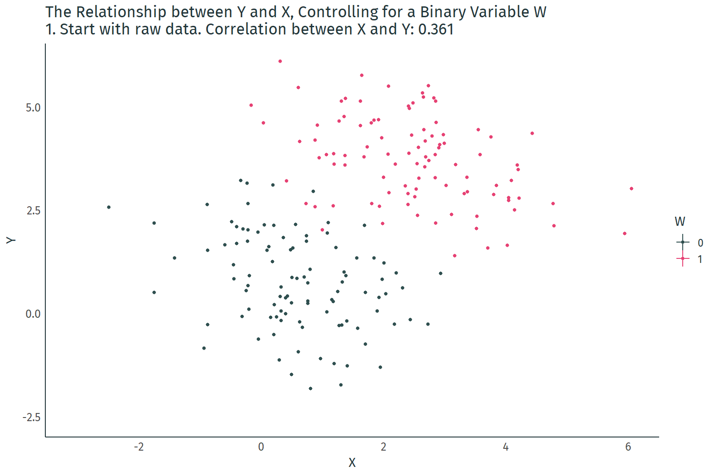

class: inverse, middle

```{r Setup, include = F}
options(htmltools.dir.version = FALSE)
library(pacman)
# devtools::install_github("dill/emoGG")
library(pacman)
p_load(
  broom, here, tidyverse,
  emoGG, latex2exp, ggplot2, ggthemes, viridis, extrafont, gridExtra,
  kableExtra,
  data.table, dagitty, ggdag,
  dplyr, gganimate,
  lubridate,
  magrittr, knitr, parallel
)
# Define colors
red_pink <- "#e64173"
met_slate <- "#272822" 
turquoise <- "#20B2AA"
orange <- "#FFA500"
red <- "#fb6107"
blue <- "#2b59c3"
green <- "#8bb174"
grey_light <- "grey70"
grey_mid <- "grey50"
grey_dark <- "grey20"
purple <- "#6A5ACD"
slate <- "#314f4f"
# Notes directory
dir_slides <- "Lectures/05-Regression/"
# Knitr options
opts_chunk$set(
  comment = "#>",
  fig.align = "center",
  fig.height = 7,
  fig.width = 10.5,
  #dpi = 300,
  #cache = T,
  warning = F,
  message = F
)  
theme_simple <- theme_bw() + theme(
  axis.line = element_line(color = met_slate),
  panel.grid = element_blank(),
  rect = element_blank(),
  strip.text = element_blank(),
  text = element_text(family = "Fira Sans", color = met_slate, size = 14),
  axis.text.x = element_text(size = 12),
  axis.text.y = element_text(size = 12),
  axis.ticks = element_blank(),
  plot.title = element_blank(),
  legend.position = "none"
)
theme_gif <- theme_bw() + theme(
  axis.line = element_line(color = met_slate),
  panel.grid = element_blank(),
  rect = element_blank(),
  strip.text = element_blank(),
  text = element_text(family = "Fira Sans", color = met_slate, size = 14),
  axis.text.x = element_text(size = 12),
  axis.text.y = element_text(size = 12),
  axis.ticks = element_blank()
)
```

# Prologue

---
# Housekeeping

**Problem Set 2 due 01/24**, which will address review content, fundamental thoughts and today's content. 

First computational portion of problem sets, so make sure you've got **R** working **before Monday**.

--

.hi-pink[So far] we've identified the fundamental problem econometricians face. How do we proceed? **Regressions**

--

- Running models

- Confounders

- Omitted Variable Bias

---
class: inverse, middle

# Regression Logic

---
# Regression

Modeling is about reducing something really complicated into something simple that still represents some part of the complicated reality.

- It’s about telling stories that are easy to understand, and thus, easy to learn from

Economists often rely on .hi-pink[(linear) regression] for statistical comparisons.

- *"Linear"* is more flexible than you think

- Describes the relationship between a dependent (endogenous) variable and one or more explanatory (exogenous) variable(s)

We will focus on the .hi-slate[simple univariate] case today.

---

# Regression

<br>

Regression analysis helps us make *all else equal* comparisons.

- We can model the effect of $X$ on $Y$ while .hi[controlling] .pink[for potential confounders].
- Forces us to be explicit about the potential sources of selection bias.
- Failure to control for confounding variables leads to .hi[omitted-variable bias], a close cousin of selection bias
- Why? The omitted variable, correlated with our covariate of interest, is sitting inside the error term causing chaos

---
# Returns to Private College

<br>

**Research Question:** Does going to a private college instead of a public college increase future earnings?

- **Outcome variable:** earnings
- **Treatment variable:** going to a private college (binary)

--

**Q:** How might a private school education increase earnings?

--

**Q:** Does a comparison of the average earnings of private college graduates with those of public school graduates .pink[isolate the economic returns to private college education]? Why or why not?

---
# Returns to Private College

**How might we estimate the causal effect of private college on earnings?**

**Approach 1:** Compare average earnings of private college graduates with those of public college graduates.

- Prone to selection bias.

**Approach 2:** Use a matching estimator that compares the earnings of individuals the same admissions profiles.

- Cleaner comparison than a simple difference-in-means.
- Somewhat difficult to implement.
- Throws away data (inefficient).

**Approach 3:** Estimate a regression that compares the earnings of individuals with the same admissions profiles.

<!-- --- -->
<!-- # Difference-in-Means, Take 2 -->

<!-- ## Example: Returns to private college -->

<!-- show same data with groupings based on application profile; what are the differences/similarities within/across groups?; calculate within-group diff-in-means; take average of these (unweighted, then weighted); show and discuss causal diagram -->

<!-- --- -->
<!-- # Difference-in-Means, Regression style -->

<!-- ## Example: Returns to private college -->

<!-- write pop model, describe coefficients and regression lingo; hand wave about OLS and estimated pop model; run regression of example data -->

---
# The Regression Model

We can estimate the effect of $X$ on $Y$ by estimating a .hi[regression model]:

$$Y_i = \beta_0 + \beta_1 X_i + u_i$$

- $Y_i$ is the outcome variable.

--

- $X_i$ is the treatment variable (continuous).

--

- $\beta_0$ is the **intercept** parameter. $\mathop{\mathbb{E}}\left[ {Y_i | X_i=0} \right] = \beta_0$

--

- $\beta_1$ is the **slope** parameter, which under the correct causal setting represents marginal change in $X_i$'s effect on $Y_i$. $\frac{\partial Y_i}{\partial X_i} = \beta_1$


--

- $u_i$ is an error (disturbance) term that includes all other (omitted) factors affecting $Y_i$.

---

# The Error term

<br>

$u_i$ is quite special. If we consider the data generating process of variable $Y_i$, $u_i$ captures all the unobserved variables that explain variation in $Y_i$. 

- Always some error to our models, we just aim for it to be small relative to the challenge we face

- Some aspects of the observed data that was collected may also have been inputted correctly (measurement error)

The error term is the price we are willing to accept for a more simplified model. 

---

# Running Regressions

The intercept and slope are population parameters.

Using an estimator with data on $X_i$ and $Y_i$, we can estimate a .hi[fitted regression line]:

$$\hat{Y_i} = \hat{\beta}_0 + \hat{\beta}_1 X_i$$

- $\hat{Y_i}$ is the **fitted value** of $Y_i$.

- $\hat{\beta}_0$ is the **estimated intercept**.

- $\hat{\beta}_1$ is the **estimated slope**.

--

The estimation procedure produces misses called .hi[residuals], defined as $Y_i - \hat{Y_i}$.

---
# Running Regressions

<br>

In practice, we estimate the regression coefficients using an estimator called .hi[Ordinary Least Squares] (OLS).

- Picks estimates that make $\hat{Y_i}$ as close as possible to $Y_i$ given the information we have on $X$ and $Y$.

- The residual sum of squares (RSS), $\sum_{i=1}^n (Y_i - \hat{Y_i})^2$, gives us an idea of how accurate our model is. 

- .hi[OLS] minimizes this sum. 
 
- We will dive into the details next class.

---
# Running Regressions

OLS picks $\hat{\beta}_0$ and $\hat{\beta}_1$ that trace out the line of best fit. Ideally, we wound like to interpret the slope of the line as the causal effect of $X$ on $Y$.

```{r, cache = T, include = F}
df <- data.frame(W = as.integer((1:200>100))) %>%
  mutate(X = .5+2*W + rnorm(200)) %>%
  mutate(Y = -.5*X + 4*W + 1 + rnorm(200),time="1") %>%
  group_by(W) %>%
  mutate(mean_X=mean(X),mean_Y=mean(Y)) %>%
  ungroup()
```

```{r, dev = "svg", echo = F, fig.height = 5.5}
ggplot(data = df, aes(y = Y, x = X)) +
  geom_point() +
  geom_smooth(method = lm, se = F, color = "#9370DB") +
  theme_simple
```

---
# Confounders

However, the data are grouped by a third variable $W$. How would omitting $W$ from the regression model affect the slope estimator?

```{r, dev = "svg", echo = F, fig.height = 5.5}
ggplot(data = df, aes(y = Y, x = X, color = as.factor(W))) +
  geom_point() +
  theme_gif + 
  labs(color = "W") +
  scale_color_manual(values = c("darkslategrey", red_pink))
```

---
# Confounders

The problem with $W$ is that it affects both $Y$ and $X$. Without adjusting for $W$, we cannot isolate the causal effect of $X$ on $Y$.

```{r, dev = "svg", echo = F, fig.height = 5.5}
dag1 <- dagify(Y ~ X + W,
               X ~ W,
               exposure = "X",
               outcome = "Y")

ggplot(data = dag1, aes(x = x, y = y, xend = xend, yend = yend)) +
      geom_dag_point(color = red_pink) +
      geom_dag_edges() +
      geom_dag_text(family = "Fira Sans") +
      theme_dag()
```

---
# Controlling for Confounders

We can control for $W$ by specifying it in the regression model:

$$Y_i = \beta_0 + \beta_1 X_i + \beta_2 W_i + u_i$$

- $W_i$ is a **control variable**.

- By including $W_i$ in the regression, we can use OLS can difference out the confounding effect of $W$.

- **Note:** OLS doesn't care whether a right-hand side variable is a treatment or control variable, but we do.

---
# Controlling for Confounders

.center[]

---
# Controlling for Confounders

Controlling for $W$ "adjusts" the data by **differencing out** the group-specific means of $X$ and $Y$. .hi-purple[Slope of the estimated regression line changes!]

```{r, dev = "svg", echo = F, fig.height = 5.5}
df %>%
  mutate(W = as.factor(W)) %>% 
  group_by(W) %>%
  mutate(X = X - mean_X,
         Y = Y - mean_Y) %>%
  ggplot(aes(y = Y, x = X, color = W)) +
  geom_point() +
  geom_smooth(method = lm, se = F, color = "#9370DB") +
  theme_simple +
  xlab("Adjusted X") + ylab("Adjusted Y") +
  scale_color_manual(values = c("darkslategrey", red_pink))
```

---
# Controlling for Confounders

Can we interpret the estimated slope parameter as the causal effect of $X$ on $Y$ now that we've adjusted for $W$?

```{r, dev = "svg", echo = F, fig.height = 5.5}
dag2 <- dagify(Y ~ X + W,
               X ~ W,
               exposure = "X",
               outcome = "Y") 
dag2 %>% 
  node_descendants("W") %>%
  ggplot(aes(
  x = x,
  y = y,
  xend = xend,
  yend = yend,
  color = descendant
  )) +
  geom_dag_point() +
  geom_dag_edges() +
  geom_dag_text(col = "white", family = "Fira Sans") +
  theme_dag() +
  scale_color_hue(breaks  = c("ancestor", "descendant")) +
  theme(legend.position = "none") +
  scale_color_manual(values = c("darkslategrey", red_pink))
```

---
# Controlling for Confounders

## Example: Returns to schooling

Last class:

> **Q:** Could we simply compare the earnings those with more education to those with less?
> <br> **A:** If we want to measure the causal effect, probably not.

.hi-green[What omitted variables should we worry about?]

---
# Controlling for Confounders

## Example: Returns to schooling

Three regressions ***of*** wages ***on*** schooling.

```{R, table, echo = F, escape = F}
tab <- data.frame(
  v1 = c("Intercept", "", "Education", "", "IQ Score", "", "South", ""),
  v2 = rbind(
    c(5.571, 0.052, "", ""),
    c("(0.039)", "(0.003)", "", "")
  ) %>% as.vector(),
  v3 = rbind(
    c(5.581, 0.026, 0.004, ""),
    c("(0.066)", "(0.005)", "(0.001)", "")
  ) %>% as.vector(),
  v4 = rbind(
    c(5.695, 0.027, 0.003, -0.127),
    c("(0.068)", "(0.005)", "(0.001)", "(0.019)")
  ) %>% as.vector()
) %>% kable(
  escape = F,
  col.names = c("Explanatory variable", "1", "2", "3"),
  align = c("l", rep("c", 4)),
  caption = "Outcome variable: log(Wage)"
) %>%
row_spec(1:8, color = met_slate) %>%
row_spec(seq(2,8,2), color = "#c2bebe") %>%
row_spec(1:8, extra_css = "line-height: 110%;") %>%
column_spec(1, color = "black", italic = T)
tab %>% column_spec(2, bold = T)
```

---
count: false

# Controlling for Confounders

## Example: Returns to schooling

Three regressions ***of*** wages ***on*** schooling.

```{R, table2, echo = F}
tab %>% column_spec(3, bold = T)
```

---
count: false

# Controlling for Confounders

## Example: Returns to schooling

Three regressions ***of*** wages ***on*** schooling.

```{R, table3, echo = F}
tab %>% column_spec(4, bold = T)
```

---

# Omitted-Variable Bias

The presence of omitted-variable bias (OVB) precludes causal interpretation of our slope estimates.

We can back out the sign and magnitude of OVB by subtracting the .pink[slope estimate from a ***long*** regression] from the .purple[slope estimate from a ***short*** regression]:

$$\text{OVB} = \color{#9370DB}{\hat{\beta}_1^{\text{Short}}} - \color{#e64173}{\hat{\beta}_1^{\text{Long}}}$$

--

__Dealing with potential sources of OVB is one of the main objectives of econometric analysis!__

<!-- Find example RCT data and run through R example w/ diff-in-means and regression -->

<!-- https://www.povertyactionlab.org/evaluation/summer-jobs-reduce-violence-among-disadvantaged-youth-united-states -->

---

# OVB vs. Irrelevant Variables

<br>

So if we risk bias as a result of excluding a variable, why not throw every possible variable and transformation of variables (log-linearized, squared, inverted) at the model?

- Time consuming

- Data not always available

- Irrelevant variables actually make matters **worse**

---

# OVB vs. Irrelevant Variables

How can more variables cause trouble? .hi-pink[Loss of efficiency] in estimator while still unbiased. 

- This is the classic .hi-pink[multicollinearity] problem

- If an irrelevant variable is highly correlated with your explanatory variable of interest, the standard error will increase

- Inference of the coefficient's significance becomes muddled by higher standard error term

- More details on what this looks like statistically next week

---

# Summary

.hi-orange[What to remember]

- Regressions are models of how we imagine the data generating process plays out

- They are usually simplifications of real life observations

- A linear regression fits a line through the data to reveal the relationship between treatment and outcome

- Confounders, omitted variables and irrelevant variables all pose risks to the identification challenge involved in estimating a population parameter of interest in our regression model

- OLS is the most common algoritm for estimating regressions, and that is what our next lecture will focus on


---

exclude: true

```{R generate pdfs, include = F, eval = F}
#remotes::install_github('rstudio/pagedown')
library(pagedown)
pagedown::chrome_print("05-Regression.html", output = "05-Regression.pdf")
```


