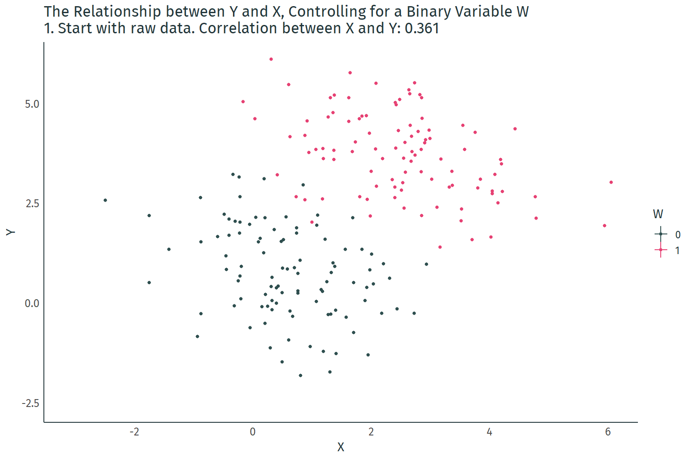

class: inverse, middle

```{r Setup, include = F}
options(htmltools.dir.version = FALSE)
library(pacman)
p_load(ggthemes, viridis, knitr, extrafont, tidyverse, magrittr, wooldridge, dagitty, ggdag, latex2exp, parallel, broom, kableExtra, ggforce, furrr)

# Define colors
red_pink <- "#e64173"
turquoise <- "#20B2AA"
orange <- "#FFA500"
red <- "#fb6107"
blue <- "#2b59c3"
green <- "#8bb174"
grey_light <- "grey70"
grey_mid <- "grey50"
grey_dark <- "grey20"
purple <- "#6A5ACD"
met_slate <- "#23373b" # metropolis font color
# Knitr options
opts_chunk$set(
  comment = "#>",
  fig.align = "center",
  fig.height = 7,
  fig.width = 10.5,
  #dpi = 300,
  #cache = T,
  warning = F,
  message = F
)  
theme_gif <- theme_bw() + theme(
  axis.line = element_line(color = met_slate),
  panel.grid = element_blank(),
  rect = element_blank(),
  strip.text = element_blank(),
  text = element_text(family = "Fira Sans", color = met_slate, size = 14),
  axis.text.x = element_text(size = 12),
  axis.text.y = element_text(size = 12),
  axis.ticks = element_blank()
)
theme_simple <- theme_bw() + theme(
  axis.line = element_line(color = met_slate),
  panel.grid = element_blank(),
  rect = element_blank(),
  strip.text = element_blank(),
  text = element_text(family = "Fira Sans", color = met_slate, size = 14),
  axis.text.x = element_text(size = 12),
  axis.text.y = element_text(size = 12),
  axis.ticks = element_blank(),
  plot.title = element_blank(),
  legend.position = "none"
)
theme_empty <- theme_bw() + theme(
  line = element_blank(),
  rect = element_blank(),
  strip.text = element_blank(),
  axis.text = element_blank(),
  plot.title = element_blank(),
  axis.title = element_blank(),
  plot.margin = structure(c(0, 0, -1, -1), unit = "lines", valid.unit = 3L, class = "unit"),
  legend.position = "none"
)
# election data
election <- read_csv("election_2016.csv") %>% 
  mutate(trump_pct = trump/totalvotes*100,
         clinton_pct = clinton/totalvotes*100,
         trump_margin = trump_pct - clinton_pct,
         nonwhite = 100 - white)
```

# Prologue

---
# Other Things Being Equal

**Goal:** Isolate the effect of one variable on another.

- All else equal, how does increasing $X$ affect $Y$.

--

**Challenge:** Changes in $X$ often coincide with changes in other variables.

- Failure to account for other changes can _bias_ OLS estimates of the effect of $X$ on $Y$.

--

**A potential solution:** Account for other variables using .hi[multiple linear regression].

- Easier to defend the exogeneity assumption. 

---
# Other Things Equal?

OLS picks $\hat{\beta}_0$ and $\hat{\beta}_1$ that trace out the line of best fit. Ideally, we wound like to interpret the slope of the line as the causal effect of $X$ on $Y$.

```{r, cache = T, include = F}
df <- data.frame(W = as.integer((1:200>100))) %>%
  mutate(X = .5+2*W + rnorm(200)) %>%
  mutate(Y = -.5*X + 4*W + 1 + rnorm(200),time="1")
  
df2 <- df %>% 
  group_by(W) %>%
  mutate(mean_X=mean(X),mean_Y=mean(Y)) %>%
  ungroup()
```

```{r, dev = "svg", echo = F, fig.height = 5.5}
ggplot(data = df2, aes(y = Y, x = X)) +
  geom_point() +
  geom_smooth(method = lm, se = F, color = "#9370DB") +
  theme_simple
```

---
# Confounders

However, the data are grouped by a third variable $W$. How would omitting $W$ from the regression model affect the slope estimator?

```{r, dev = "svg", echo = F, fig.height = 5.5}
ggplot(data = df2, aes(y = Y, x = X, color = as.factor(W))) +
  geom_point() +
  theme_gif + 
  labs(color = "W") +
  scale_color_manual(values = c("darkslategrey", red_pink))
```

---
# Confounders

The problem with $W$ is that it affects both $Y$ and $X$. Without adjusting for $W$, we cannot isolate the causal effect of $X$ on $Y$.

```{r, dev = "svg", echo = F, fig.height = 5.5}
dag1 <- dagify(Y ~ X + W,
               X ~ W,
               exposure = "X",
               outcome = "Y")

ggplot(data = dag1, aes(x = x, y = y, xend = xend, yend = yend)) +
      geom_dag_point(color = red_pink) +
      geom_dag_edges() +
      geom_dag_text(family = "Fira Sans") +
      theme_dag()
```

---
# Controlling for Confounders

```{r, include = F, cache = T}
# the code below produces the gif, but throws an error that prevents me from compiling the slides

# #Calculate correlations
# before_cor <- paste("1. Start with raw data. Correlation between X and Y: ",round(cor(df$X,df$Y),3),sep='')
# after_cor <- paste("6. Analyze what's left! Correlation between X and Y controlling for W: ",round(cor(df$X-df$mean_X,df$Y-df$mean_Y),3),sep='')
# 
# #Add step 2 in which X is demeaned, and 3 in which both X and Y are, and 4 which just changes label
# dffull <- rbind(
#   #Step 1: Raw data only
#   df %>% mutate(mean_X=NA,mean_Y=NA,time=before_cor),
#   #Step 2: Add x-lines
#   df %>% mutate(mean_Y=NA,time='2. Figure out what differences in X are explained by W'),
#   #Step 3: X de-meaned 
#   df %>% mutate(X = X - mean_X,mean_X=0,mean_Y=NA,time="3. Remove differences in X explained by W"),
#   #Step 4: Remove X lines, add Y
#   df %>% mutate(X = X - mean_X,mean_X=NA,time="4. Figure out what differences in Y are explained by W"),
#   #Step 5: Y de-meaned
#   df %>% mutate(X = X - mean_X,Y = Y - mean_Y,mean_X=NA,mean_Y=0,time="5. Remove differences in Y explained by W"),
#   #Step 6: Raw demeaned data only
#   df %>% mutate(X = X - mean_X,Y = Y - mean_Y,mean_X=NA,mean_Y=NA,time=after_cor))
# 
# p <- ggplot(dffull,aes(y=Y,x=X,color=as.factor(W)))+geom_point()+
#   geom_vline(aes(xintercept=mean_X,color=as.factor(W)))+
#   geom_hline(aes(yintercept=mean_Y,color=as.factor(W)))+
#   guides(color=guide_legend(title="W"))+
#   scale_color_manual(values = c("darkslategrey", red_pink)) +
#   labs(title = 'The Relationship between Y and X, Controlling for a Binary Variable W \n{next_state}')+
#   transition_states(time,transition_length=c(12,32,12,32,12,12),state_length=c(160,100,75,100,75,160),wrap=FALSE)+
#   ease_aes('sine-in-out')+
#   exit_fade()+enter_fade() +
#   theme_gif
# 
# anim_save(
#   animation = p,
#   filename = "control.gif",
#   path = dir_slides,
#   width = 10.5,
#   height = 7,
#   units = "in",
#   res = 150,
#   nframes = 200
# )
```

.center[]

---
# Controlling for Confounders

```{r}
lm(Y ~ X, data = df) %>% tidy()
```

--

```{r}
lm(Y ~ X + W, data = df) %>% tidy()
```

---
class: inverse, middle

# Multiple Linear Regression

---
# Multiple Linear Regression

## More explanatory variables

**Simple linear regression** features one .pink[outcome variable] and one .purple[explanatory variable]:

$$\color{#e64173}{Y_i} = \beta_0 + \beta_1 \color{#9370DB}{X_i} + u_i.$$

**Multiple linear regression** features one .pink[outcome variable] and multiple .purple[explanatory variables]:

$$\color{#e64173}{Y_i} = \beta_0 + \beta_1 \color{#9370DB}{X_{1i}} + \beta_2 \color{#9370DB}{X_{2i}} + \cdots + \beta_{k} \color{#9370DB}{X_{ki}} + u_i.$$

--

**Why?**

--

- Better explain the variation in $Y$.
- Improve predictions.
- Avoid bias.

---
# Multiple Linear Regression

```{R, echo = F, dev = "svg"}
# Colors (order: x1, x2, x3, y)
venn_colors <- c(purple, red, "grey60", orange)
# Locations of circles
venn_df <- tibble(
  x  = c( 0.0,   -0.5,    1.5,   -1.0),
  y  = c( 0.0,   -2.5,   -1.8,    2.0),
  r  = c( 1.9,    1.5,    1.5,    1.3),
  l  = c( "Y", "X[1]", "X[2]", "X[3]"),
  xl = c( 0.0,   -0.5,    1.6,   -1.0),
  yl = c( 0.0,   -2.5,   -1.9,    2.2)
)
# Venn
ggplot(data = venn_df, aes(x0 = x, y0 = y, r = r, fill = l, color = l)) +
geom_circle(alpha = 0.3, size = 0.75) +
theme_void() +
theme(legend.position = "none") +
scale_fill_manual(values = venn_colors) +
scale_color_manual(values = venn_colors) +
geom_text(aes(x = xl, y = yl, label = l), size = 9, family = "Fira Sans", parse = T) +
xlim(-3, 3) +
ylim(-4, 3.4) +
coord_equal()
```

---
# OLS Estimation

As was the case with simple linear regressions, OLS minimizes the sum of squared residuals (RSS).

However, residuals are now defined as

$$\hat{u}_i = Y_i - \hat{\beta}_0 - \hat{\beta}_1 X_{1i} - \hat{\beta}_2 X_{2i} - \cdots - \hat{\beta}_{k} X_{ki}.$$

--

To obtain estimates, take partial derivatives of RSS with respect to each $\hat{\beta}$, set each derivative equal to zero, and solve the system of $k+1$ equations.

- Without matrices, the algebra is difficult. For the remainder of this course, we will let .mono[R] do the work for us.

---
# Coefficient Interpretation

**Model**

$$\color{}{Y_i} = \beta_0 + \beta_1 \color{}{X_{1i}} + \beta_2 \color{}{X_{2i}} + \cdots + \beta_{k} \color{}{X_{ki}} + u_i.$$

**Interpretation**

- The intercept $\hat{\beta}_0$ is the average value of $Y_i$ when all of the explanatory variables are equal to zero.
- Slope parameters $\hat{\beta}_1, \dots, \hat{\beta}_{k}$ give us the change in $Y_i$ from a one-unit change in $X_j$, holding the other $X$ variables constant. 

---
# Algebraic Properties of OLS

The OLS first-order conditions yield the same properties as before.

1. Residuals sum to zero: $\sum_{i=1}^n \hat{u_i} = 0$.

2. The sample covariance between the independent variables and the residuals is zero.

3. The point $(\bar{X_1}, \bar{X_2}, \dots, \bar{X_k}, \bar{Y})$ is always on the fitted regression "line."

---
# Goodness of Fit

Fitted values are defined similarly:

$$\hat{Y_i} = \hat{\beta}_0 + \hat{\beta}_1 X_{1i} + \hat{\beta}_2 X_{2i} + \cdots + \hat{\beta}_{k} X_{ki}.$$

The formula for $R^2$ is the same as before:

$$R^2 =\frac{\sum(\hat{Y_i}-\bar{Y})^2}{\sum(Y_i-\bar{Y})^2}.$$

---
# Goodness of Fit

**Model 1:** $Y_i = \beta_0 + \beta_1 X_{1i} + u_i$.

**Model 2:** $Y_i = \beta_0 + \beta_1 X_{1i} + \beta_2 X_{2i} + v_i$

--

.hi-green[True or false?]

Model 2 will yield a lower $R^2$ than Model 1.

- Hint: Think of $R^2$ as $R^2 = 1 - \frac{\text{RSS}}{\text{TSS}}$.

---
# Goodness of Fit 

```{R, echo = F, dev = "svg"}
# Colors (order: x1, x2, x3, y)
venn_colors <- c(purple, orange)
# Locations of circles
venn_df <- tibble(
  x  = c( 0.0,   -0.5),
  y  = c( 0.0,   -2.5),
  r  = c( 1.9,    1.5),
  l  = c( "Y", "X[1]"),
  xl = c( 0.0,   -0.5),
  yl = c( 0.0,   -2.5)
)
# Venn
ggplot(data = venn_df, aes(x0 = x, y0 = y, r = r, fill = l, color = l)) +
geom_circle(alpha = 0.3, size = 0.75) +
theme_void() +
theme(legend.position = "none") +
scale_fill_manual(values = venn_colors) +
scale_color_manual(values = venn_colors) +
geom_text(aes(x = xl, y = yl, label = l), size = 9, family = "Fira Sans", parse = T) +
annotate(
  x = 1, y = 3,
  geom = "text", label = "Model 1", size = 9, color = met_slate, family = "Fira Sans", hjust = 0
) +
xlim(-3, 3) +
ylim(-4, 3.4) +
coord_equal()
```

---
# Goodness of Fit 

```{R, echo = F, dev = "svg"}
# Colors (order: x1, x2, x3, y)
venn_colors <- c(purple, red, orange)
# Locations of circles
venn_df <- tibble(
  x  = c( 0.0,   -0.5, -1.0),
  y  = c( 0.0,   -2.5, 2.0),
  r  = c( 1.9,    1.5, 1.3),
  l  = c( "Y", "X[1]", "X[2]"),
  xl = c( 0.0,   -0.5, -1.0),
  yl = c( 0.0,   -2.5, 2.2)
)
# Venn
ggplot(data = venn_df, aes(x0 = x, y0 = y, r = r, fill = l, color = l)) +
geom_circle(alpha = 0.3, size = 0.75) +
theme_void() +
theme(legend.position = "none") +
scale_fill_manual(values = venn_colors) +
scale_color_manual(values = venn_colors) +
geom_text(aes(x = xl, y = yl, label = l), size = 9, family = "Fira Sans", parse = T) +
annotate(
  x = 1, y = 3,
  geom = "text", label = "Model 2", color = met_slate, size = 9, family = "Fira Sans", hjust = 0
) +
xlim(-3, 3) +
ylim(-4, 3.4) +
coord_equal()
```

---
# Goodness of Fit

**Problem:** As we add variables to our model, $R^2$ *mechanically* increases.

--

To see this problem, we can simulate a dataset of 10,000 observations on $y$ and 1,000 random $x_k$ variables. **No relations between $y$ and the $x_k$!**

Pseudo-code outline of the simulation:
--

.pseudocode-small[

- Generate 10,000 observations on $y$
- Generate 10,000 observations on variables $x_1$ through $x_{1000}$
- Regressions
  - LM<sub>1</sub>: Regress $y$ on $x_1$; record R<sup>2</sup>
  - LM<sub>2</sub>: Regress $y$ on $x_1$ and $x_2$; record R<sup>2</sup>
  - ...
  - LM<sub>1000</sub>: Regress $y$ on $x_1$, $x_2$, ..., $x_{1000}$; record R<sup>2</sup>
]

---
# Goodness of Fit

**Problem:** As we add variables to our model, $R^2$ *mechanically* increases.

.mono[R] code for the simulation:

```{R, r2 data code, eval = F, cache = T}
set.seed(1234)
plan(multiprocess)
y <- rnorm(1e4)
x <- matrix(data = rnorm(1e7), nrow = 1e4)
x %<>% cbind(matrix(data = 1, nrow = 1e4, ncol = 1), x)
r_fun <- function(i) {
 tmp_reg <- lm(y ~ x[,1:(i + 1)]) %>% summary()
                    data.frame(
                    k = i + 1,
                    r2 = tmp_reg$r.squared,
                    r2_adj = tmp_reg$adj.r.squared)
}
r_df <- future_map(1:(1e3-1), r_fun) %>% bind_rows()
```

---
# Goodness of Fit

**Problem:** As we add variables to our model, $\color{#314f4f}{R^2}$ *mechanically* increases.

```{R, r2 data, include = F, cache = T}
set.seed(1234)
plan(multiprocess)
y <- rnorm(1e4)
x <- matrix(data = rnorm(1e7), nrow = 1e4)
x %<>% cbind(matrix(data = 1, nrow = 1e4, ncol = 1), x)

r_fun <- function(i) {
  tmp_reg <- lm(y ~ x[,1:(i + 1)]) %>% summary()
                     data.frame(
                     k = i + 1,
                     r2 = tmp_reg$r.squared,
                     r2_adj = tmp_reg$adj.r.squared)
}

r_df <- future_map(1:(1e3-1), r_fun) %>% bind_rows()
```

```{R, r2 plot, echo = F, dev = "svg", fig.height = 6.25}
ggplot(data = r_df, aes(x = k, y = r2)) +
geom_hline(yintercept = 0) +
geom_vline(xintercept = 0) +
geom_line(size = 2, alpha = 0.75, color = "darkslategrey") +
geom_line(aes(y = r2_adj), size = 0.2, alpha = 0, color = red_pink) +
ylab(TeX("R^2")) +
xlab("Number of explanatory variables (k)") +
theme_pander(base_size = 18)
```

---
# Goodness of Fit

**One solution:** .pink[Adjusted] $\color{#e64173}{R^2}$

```{R, adjusted r2 plot, echo = F, dev = "svg", fig.height = 6.25}
ggplot(data = r_df, aes(x = k, y = r2)) +
geom_hline(yintercept = 0) +
geom_vline(xintercept = 0) +
geom_line(size = 2, alpha = 0.15, color = "darkslategrey") +
geom_line(aes(y = r2_adj), size = 2, alpha = 0.85, color = red_pink) +
ylab(TeX("R^2")) +
xlab("Number of explanatory variables (k)") +
theme_pander(base_size = 18)
```

---
# Goodness of Fit

**Problem:** As we add variables to our model, $R^2$ *mechanically* increases.

**One solution:** Penalize for the number of variables, _e.g._, adjusted $R^2$:

$$ \bar{R}^2 = 1 - \dfrac{\sum_i \left( Y_i - \hat{Y}_i \right)^2/(n-k-1)}{\sum_i \left( Y_i - \bar{Y} \right)^2/(n-1)} $$

*Note:* Adjusted $R^2$ need not be between 0 and 1.

---
# Goodness of Fit

## Example: 2016 Election

```{r}
lm(trump_margin ~ white, data = election) %>% glance()
```

--

```{r}
lm(trump_margin ~ white + poverty, data = election) %>% glance()
```
---
# OLS Assumptions 

Same as before, except for .pink[assumption 2]:

1. **Linearity:** The population relationship is linear in parameters with an additive error term.
2. .hi[No perfect collinearity:] .pink[No] $\color{#e64173}{X}$ .pink[variable is a perfect linear combination of the others.]
3. **Random Sampling:** We have a random sample from the population of interest.
4. **Exogeneity:** The $X$ variable is exogenous (*i.e.,* $\mathop{\mathbb{E}}\left( u|X \right) = 0$).
5. **Homoskedasticity:** The error term has the same variance for each value of the independent variable (*i.e.,* $\mathop{\text{Var}}(u|X) = \sigma^2$).
6. **Normality:** The population error term is normally distributed with mean zero and variance $\sigma^2$ (*i.e.,* $u \sim N(0,\sigma^2)$)

---
# Perfect Collinearity

## Example: 2016 Election

OLS cannot estimate parameters for .mono[white] and .mono[nonwhite] simultaneously.

- .mono[white] .mono[=] 100 .mono[-] .mono[nonwhite].

--

```{r}
lm(trump_margin ~ white + nonwhite, data = election) %>% tidy()
```

.mono[R] drops perfectly collinear variables for you.

---
# Multiple Linear Regression 

## Tradeoffs

There are tradeoffs to remember as we add/remove variables:

**Fewer variables**

- Generally explain less variation in $y$.
- Provide simple interpretations and visualizations (*parsimonious*).
- May need to worry about omitted-variable bias.

**More variables**

- More likely to find *spurious* relationships (statistically significant due to chance; do not reflect true, population-level relationships).
- More difficult to interpret the model.
- May still leave out important variables.

---
# Omitted Variables

```{R, venn2, dev = "svg", echo = F}
# Line types (order: x1, x2, x3, y)
venn_lines <- c("solid", "dotted", "solid")
# Venn
ggplot(data = venn_df, aes(x0 = x, y0 = y, r = r, fill = l, color = l)) +
geom_circle(aes(linetype = l), alpha = 0.3, size = 0.75) +
theme_void() +
theme(legend.position = "none") +
scale_fill_manual(values = venn_colors) +
scale_color_manual(values = venn_colors) +
scale_linetype_manual(values = venn_lines) +
geom_text(aes(x = xl, y = yl, label = l), size = 9, family = "Fira Sans", parse = T) +
annotate(
  x = 1, y = 3,
  geom = "text", label = "No Bias", color = met_slate, size = 9, family = "Fira Sans", hjust = 0
) +
xlim(-3, 3) +
ylim(-4, 3.4) +
coord_equal()
```

---
# Omitted Variables

```{R, echo = F, dev = "svg"}
# Colors (order: x1, x2, x3, y)
venn_lines <- c("solid", "dotted", "solid")
# Locations of circles
venn_df <- tibble(
  x  = c( 0.0,   -0.5, 1.5),
  y  = c( 0.0,   -2.5, -1.8),
  r  = c( 1.9,    1.5, 1.5),
  l  = c( "Y", "X[1]", "X[2]"),
  xl = c( 0.0,   -0.5, 1.6),
  yl = c( 0.0,   -2.5, -1.9)
)
# Venn
ggplot(data = venn_df, aes(x0 = x, y0 = y, r = r, fill = l, color = l)) +
geom_circle(aes(linetype = l), alpha = 0.3, size = 0.75) +
theme_void() +
theme(legend.position = "none") +
scale_fill_manual(values = venn_colors) +
scale_color_manual(values = venn_colors) +
scale_linetype_manual(values = venn_lines) +
geom_text(aes(x = xl, y = yl, label = l), size = 9, family = "Fira Sans", parse = T) +
annotate(
  x = 1, y = 3,
  geom = "text", label = "Bias", color = met_slate, size = 9, family = "Fira Sans", hjust = 0
) +
xlim(-3, 3) +
ylim(-4, 3.4) +
coord_equal()
```

---
# Omitted Variables

```{R, echo = F, escape = F}
tab <- data.frame(
  v1 = c("Intercept", "", "log(Spend)", "", "Lunch", ""),
  v2 = rbind(
    c(-84.84, -1.52, ""),
    c("(18.57)", "(2.18)", "")
  ) %>% as.vector(),
  v3 = rbind(
    c(-6.34, 11.34, -0.47),
    c("(15.00)", "(1.77)", "(0.01)")
  ) %>% as.vector()
) %>% kable(
  escape = F,
  col.names = c("Explanatory variable", "1", "2"),
  align = c("l", rep("c", 3)),
  caption = "Math Score"
) %>%
row_spec(1:6, color = met_slate) %>%
row_spec(seq(2,6,2), color = "#c2bebe") %>%
row_spec(1:6, extra_css = "line-height: 110%;") %>%
column_spec(1, color = "black", italic = T)
tab %>% column_spec(2, bold = T)
```

Data from 1823 elementary schools in Michigan

- *Math Score* is average fourth grade state math test scores.
- *log(Spend)* is the natural logarithm of spending per pupil.
- *Lunch* is the percentage of student eligible for free or reduced-price lunch.

---
count: false

# Omitted Variables

```{R, echo = F, escape = F}
tab %>% column_spec(3, bold = T)
```

Data from 1823 elementary schools in Michigan

- *Math Score* is average fourth grade state math test scores.
- *log(Spend)* is the natural logarithm of spending per pupil.
- *Lunch* is the percentage of student eligible for free or reduced-price lunch.

---
# Omitted-Variable Bias

**Model 1:** $Y_i = \beta_0 + \beta_1 X_{1i} + u_i$.

**Model 2:** $Y_i = \beta_0 + \beta_1 X_{1i} + \beta_2 X_{2i} + v_i$

Estimating Model 1 (without $X_2$) yields .hi[omitted-variable bias:]

$$\color{#e64173}{\text{Bias} = \beta_2 \frac{\mathop{\text{Cov}}(X_{1i}, X_{2i})}{\mathop{\text{Var}}(X_{1i})}}.$$

--

The sign of the bias depends on

1. The correlation between $X_2$ and $Y$, _i.e._, $\beta_2$.

2. The correlation between $X_1$ and $X_2$, _i.e._, $\mathop{\text{Cov}}(X_{1i}, X_{2i})$.


