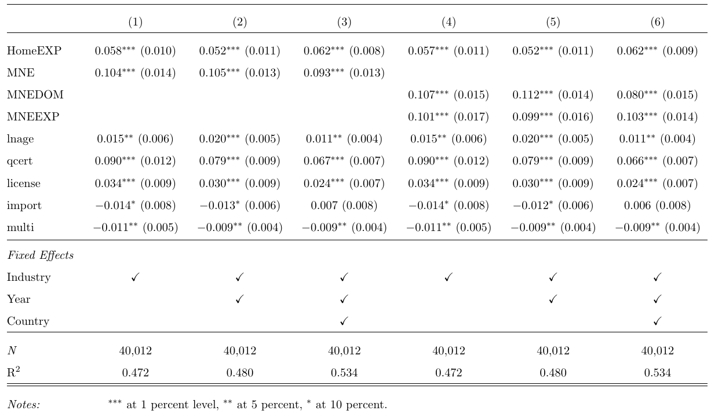

class: inverse, middle

```{r Setup, include = F}
options(htmltools.dir.version = FALSE)
knitr::opts_chunk$set(echo = TRUE, cache=TRUE)

library(pacman)
p_load(ggthemes, viridis, knitr, extrafont, tidyverse, magrittr, wooldridge, stargazer, latex2exp, parallel, broom, kableExtra, ggforce, furrr)
# Define colors
red_pink <- "#e64173"
turquoise <- "#20B2AA"
orange <- "#FFA500"
red <- "#fb6107"
blue <- "#2b59c3"
green <- "#8bb174"
grey_light <- "grey70"
grey_mid <- "grey50"
grey_dark <- "grey20"
purple <- "#6A5ACD"
met_slate <- "#23373b" # metropolis font color
# Knitr options
opts_chunk$set(
  comment = "#>",
  fig.align = "center",
  fig.height = 7,
  fig.width = 10.5,
  #dpi = 300,
  #cache = T,
  warning = F,
  message = F
)  
theme_simple <- theme_bw() + theme(
  axis.line = element_line(color = met_slate),
  panel.grid = element_blank(),
  rect = element_blank(),
  strip.text = element_blank(),
  text = element_text(family = "Fira Sans", color = met_slate, size = 14),
  axis.text.x = element_text(size = 12),
  axis.text.y = element_text(size = 12),
  axis.ticks = element_blank(),
  plot.title = element_blank(),
  legend.position = "none"
)
theme_empty <- theme_bw() + theme(
  line = element_blank(),
  rect = element_blank(),
  text = element_text(family = "Fira Sans", color = met_slate, size = 14),
  strip.text = element_blank(),
  axis.text = element_blank(),
  plot.title = element_blank(),
  axis.title = element_blank(),
  plot.margin = structure(c(0, 0, -1, -1), unit = "lines", valid.unit = 3L, class = "unit"),
  legend.position = "none"
)
# Card data
data('card')
wage_data <- card %>% 
  mutate(nonblack = ifelse(black == 0, 1, 0))

# MI school funding and test scores data
data('meap01')
```

# Prologue

---
class: inverse, middle

# Categorical Variables

---
# Categorical Variables

**Goal:** Make quantitative statements about .pink[qualitative information].

- *e.g.,* race, gender, being employed, living in Oregon, *etc.*

--

**Approach:** Construct .pink[binary variables].

- _a.k.a._ .pink[dummy variables] or .pink[indicator variables].
- Value equals 1 if observation is in the category or 0 if otherwise.

--

**Regression implications**

1. Binary variables change the interpretation of the intercept.

2. Coefficients on binary variables have different interpretations than those on continuous variables.

---
# Continuous Variables

Consider the relationship

$$ \text{Pay}_i = \beta_0 + \beta_1 \text{School}_i + u_i $$

where

- $\text{Pay}_i$ is a continuous variable measuring an individual's pay
- $\text{School}_i$ is a continuous variable that measures years of education

--

**Interpretation**

- $\beta_0$: $y$-intercept, _i.e._, $\text{Pay}$ when $\text{School} = 0$
- $\beta_1$: expected increase in $\text{Pay}$ for a one-unit increase in $\text{School}$

---
# Continuous Variables

Consider the relationship

$$ \text{Pay}_i = \beta_0 + \beta_1 \text{School}_i + u_i $$

**Derive the slope's interpretation:**

$\mathop{\mathbb{E}}\left[ \text{Pay} | \text{School} = \ell + 1 \right] - \mathop{\mathbb{E}}\left[ \text{Pay} | \text{School} = \ell \right]$
--
<br> $\quad = \mathop{\mathbb{E}}\left[ \beta_0 + \beta_1 (\ell + 1) + u \right] - \mathop{\mathbb{E}}\left[ \beta_0 + \beta_1 \ell + u \right]$
--
<br> $\quad = \left[ \beta_0 + \beta_1 (\ell + 1) \right] - \left[ \beta_0 + \beta_1 \ell \right]$
--
<br> $\quad = \beta_0 - \beta_0 + \beta_1 \ell - \beta_1 \ell + \beta_1$
--
<br> $\quad = \beta_1$.

--

The slope gives the expected increase in pay for an additional year of schooling.

---
# Continuous Variables

Consider the relationship

$$ \text{Pay}_i = \beta_0 + \beta_1 \text{School}_i + u_i $$

**Alternative derivation**

Differentiate the model with respect to schooling:

$$ \dfrac{d\text{Pay}}{d\text{School}} = \beta_1 $$

The slope gives the expected increase in pay for an additional year of schooling.

---
# Continuous Variables

If we have multiple explanatory variables, _e.g._,

$$ \text{Pay}_i = \beta_0 + \beta_1 \text{School}_i + \beta_2 \text{Ability}_i + u_i $$

then the interpretation changes slightly.

--

$\mathop{\mathbb{E}}\left[ \text{Pay} | \text{School} = \ell + 1 \land \text{Ability} = \alpha \right] - \mathop{\mathbb{E}}\left[ \text{Pay} | \text{School} = \ell \land \text{Ability} = \alpha \right]$
--
<br> $\quad = \mathop{\mathbb{E}}\left[ \beta_0 + \beta_1 (\ell + 1) + \beta_2 \alpha + u \right] - \mathop{\mathbb{E}}\left[ \beta_0 + \beta_1 \ell + \beta_2 \alpha + u \right]$
--
<br> $\quad = \left[ \beta_0 + \beta_1 (\ell + 1) + \beta_2 \alpha \right] - \left[ \beta_0 + \beta_1 \ell + \beta_2 \alpha \right]$
--
<br> $\quad = \beta_0 - \beta_0 + \beta_1 \ell - \beta_1 \ell + \beta_1 + \beta_2 \alpha - \beta_2 \alpha$
--
<br> $\quad = \beta_1$

--

The slope gives the expected increase in pay for an additional year of schooling, **holding ability constant**.

---
# Continuous Variables

If we have multiple explanatory variables, _e.g._,

$$ \text{Pay}_i = \beta_0 + \beta_1 \text{School}_i + \beta_2 \text{Ability}_i + u_i $$

then the interpretation changes slightly.

--

**Alternative derivation**

Differentiate the model with respect to schooling:

$$ \dfrac{\partial\text{Pay}}{\partial\text{School}} = \beta_1 $$

The slope gives the expected increase in pay for an additional year of schooling, **holding ability constant**.

---
# Categorical Variables

Consider the relationship

$$ \text{Pay}_i = \beta_0 + \beta_1 \text{Female}_i + u_i $$

where $\text{Pay}_i$ is a continuous variable measuring an individual's pay and $\text{Female}_i$ is a binary variable equal to $1$ when $i$ is female.

**Interpretation**

$\beta_0$ is the expected $\text{Pay}$ for males (_i.e._, when $\text{Female} = 0$):

$\mathop{\mathbb{E}}\left[ \text{Pay} | \text{Male} \right]$
--
<br> $\quad = \mathop{\mathbb{E}}\left[ \beta_0 + \beta_1\times 0 + u_i \right]$
--
<br> $\quad = \mathop{\mathbb{E}}\left[ \beta_0 + 0 + u_i \right]$
--
<br> $\quad = \beta_0$

---
# Categorical Variables

Consider the relationship

$$ \text{Pay}_i = \beta_0 + \beta_1 \text{Female}_i + u_i $$

where $\text{Pay}_i$ is a continuous variable measuring an individual's pay and $\text{Female}_i$ is a binary variable equal to $1$ when $i$ is female.

**Interpretation**

$\beta_1$ is the expected difference in $\text{Pay}$ between females and males:

$\mathop{\mathbb{E}}\left[ \text{Pay} | \text{Female} \right] - \mathop{\mathbb{E}}\left[ \text{Pay} | \text{Male} \right]$
--
<br> $\quad = \mathop{\mathbb{E}}\left[ \beta_0 + \beta_1\times 1 + u_i \right] - \mathop{\mathbb{E}}\left[ \beta_0 + \beta_1\times 0 + u_i \right]$
--
<br> $\quad = \mathop{\mathbb{E}}\left[ \beta_0 + \beta_1 + u_i \right] - \mathop{\mathbb{E}}\left[ \beta_0 + 0 + u_i \right]$
--
<br> $\quad = \beta_0 + \beta_1 - \beta_0$
--
<br> $\quad = \beta_1$

---
# Categorical Variables

Consider the relationship

$$ \text{Pay}_i = \beta_0 + \beta_1 \text{Female}_i + u_i $$

where $\text{Pay}_i$ is a continuous variable measuring an individual's pay and $\text{Female}_i$ is a binary variable equal to $1$ when $i$ is female.

**Interpretation**

$\beta_0 + \beta_1$: is the expected $\text{Pay}$ for females:

$\mathop{\mathbb{E}}\left[ \text{Pay} | \text{Female} \right]$
--
<br> $\quad = \mathop{\mathbb{E}}\left[ \beta_0 + \beta_1\times 1 + u_i \right]$
--
<br> $\quad = \mathop{\mathbb{E}}\left[ \beta_0 + \beta_1 + u_i \right]$
--
<br> $\quad = \beta_0 + \beta_1$

---
# Categorical Variables

Consider the relationship

$$ \text{Pay}_i = \beta_0 + \beta_1 \text{Female}_i + u_i $$

**Interpretation**

- $\beta_0$: expected $\text{Pay}$ for males (_i.e._, when $\text{Female} = 0$)
- $\beta_1$: expected difference in $\text{Pay}$ between females and males
- $\beta_0 + \beta_1$: expected $\text{Pay}$ for females
- Males are the **reference group**

--

**Note:** If there are no other variables to condition on, then $\hat{\beta}_1$ equals the difference in group means, _e.g._, $\bar{X}_\text{Female} - \bar{X}_\text{Male}$.

--

**Note<sub>2</sub>:** The *holding all other variables constant* interpretation also applies for categorical variables in multiple regression settings.

---
# Categorical Variables

$Y_i = \beta_0 + \beta_1 X_i + u_i$ for binary variable $X_i = \{\color{#314f4f}{0}, \, \color{#e64173}{1}\}$

```{R, cat data, include = F}
# Set seed
set.seed(1235)
# Sample size
n <- 5e3
# Generate data
cat_df <- tibble(
  x = sample(x = c(0, 1), size = n, replace = T),
  y = 3 + 7 * x + rnorm(n, sd = 2)
)
# Regression
cat_reg <- lm(y ~ x, data = cat_df)
```

```{R, dat plot 1, echo = F, dev = "svg", fig.height = 5.75}
set.seed(12345)
ggplot(data = cat_df, aes(x = x, y = y, color = as.factor(x))) +
geom_jitter(width = 0.3, size = 1.5, alpha = 0.5) +
scale_color_manual(values = c("darkslategrey", red_pink)) +
theme_empty
```

---
# Categorical Variables

$Y_i = \beta_0 + \beta_1 X_i + u_i$ for binary variable $X_i = \{\color{#314f4f}{0}, \, \color{#e64173}{1}\}$

```{R, dat plot 2, echo = F, dev = "svg", fig.height = 5.75}
set.seed(12345)
ggplot(data = cat_df, aes(x = x, y = y, color = as.factor(x))) +
geom_jitter(width = 0.3, size = 1.5, alpha = 0.5) +
scale_color_manual(values = c("darkslategrey", red_pink)) +
geom_hline(yintercept = cat_reg$coefficients[1], size = 1, color = "darkslategrey") +
geom_hline(yintercept = cat_reg$coefficients[1] + cat_reg$coefficients[2], size = 1, color = red_pink) +
annotate(
  geom = "text",
  x = 0.5,
  y = -1 + cat_reg$coefficients[1],
  label = TeX("$\\hat{\\beta}_0 = \\bar{\\mathrm{Group}_0}$"),
  size = 7
) +
annotate(
  geom = "text",
  x = 0.5,
  y = 1 + cat_reg$coefficients[1] + cat_reg$coefficients[2],
  label = TeX("$\\hat{\\beta}_0 + \\hat{\\beta}_1 = \\bar{\\mathrm{Group}_1}$"),
  size = 7,
  color = red_pink
) +
theme_empty
```

---
# Multiple Regression

```{R, gen data, cache = T, include = F}
n <- 1e2
set.seed(1234)
gen_df <- tibble(
  x1 = runif(n = n, min = -3, max = 3),
  x2 = sample(x = c(F, T), size = n, replace = T),
  u  = rnorm(n = n, mean = 0, sd = 1),
  y  = -0.5 + x1 + x2 * 4 + u
)
mean_a <- filter(gen_df, x2 == F)$y %>% mean()
mean_b <- filter(gen_df, x2 == T)$y %>% mean()
gen_df %<>% mutate(y_dm = y - mean_a * (x2 == F) - mean_b * (x2 == T))
```

$Y_i = \beta_0 + \beta_1 X_{1i} + \beta_2 X_{2i} + u_i \quad$ $X_1$ is continuous $\quad X_2$ is categorical

```{R, mult reg plot 1, dev = "svg", echo = F, fig.height = 5.75}
ggplot(data = gen_df, aes(y = y, x = x1, color = x2, shape = x2)) +
geom_hline(yintercept = 0) +
geom_vline(xintercept = 0) +
annotate("text", x = -0.075, y = 7.75, label = TeX("$Y$"), size = 8) +
annotate("text", x = 2.95, y = 0.3, label = TeX("$X_1$"), size = 8) +
geom_point(size = 3) +
ylim(c(-4.5, 8)) +
theme_empty +
scale_color_manual(
  expression(X[2]),
  values = c("darkslategrey", red_pink),
  labels = c("A", "B")
) +
scale_shape_manual(
  expression(X[2]),
  values = c(1, 19),
  labels = c("A", "B")
) +
theme(
  text = element_text(size = 20)
)
```

---
count: false

# Multiple Regression

The intercept and categorical variable $X_2$ control for the groups' means.

```{R, mult reg plot 2, dev = "svg", echo = F, fig.height = 5.75}
ggplot(data = gen_df, aes(y = y, x = x1, color = x2, shape = x2)) +
geom_hline(yintercept = mean_a, color = "darkslategrey", alpha = 0.5) +
geom_hline(yintercept = mean_b, color = red_pink, alpha = 0.5) +
geom_hline(yintercept = 0) +
geom_vline(xintercept = 0) +
annotate("text", x = -0.075, y = 7.75, label = TeX("$Y$"), size = 8) +
annotate("text", x = 2.95, y = 0.3, label = TeX("$X_1$"), size = 8) +
geom_point(size = 3) +
ylim(c(-4.5, 8)) +
theme_empty +
scale_color_manual(
  expression(X[2]),
  values = c("darkslategrey", red_pink),
  labels = c("A", "B")
) +
scale_shape_manual(
  expression(X[2]),
  values = c(1, 19),
  labels = c("A", "B")
) +
theme(
  text = element_text(size = 20)
)
```

---
count: false

# Multiple Regression

With groups' means removed:

```{R, mult reg plot 3, dev = "svg", echo = F, fig.height = 5.75}
ggplot(data = gen_df %>% mutate(y = y - 4 * x2), aes(y = y_dm, x = x1)) +
geom_hline(yintercept = 0) +
geom_vline(xintercept = 0) +
annotate("text", x = -0.075, y = 7.75, label = TeX("$Y$"), size = 8) +
annotate("text", x = 2.95, y = 0.3, label = TeX("$X_1$"), size = 8) +
geom_point(size = 3, aes(color = x2, shape = x2)) +
ylim(c(-4.5, 8)) +
theme_empty +
scale_color_manual(
  expression(X[2]),
  values = c("darkslategrey", red_pink),
  labels = c("A", "B")
) +
scale_shape_manual(
  expression(X[2]),
  values = c(1, 19),
  labels = c("A", "B")
) +
theme(
  text = element_text(size = 20)
)
```

---
count: false

# Multiple Regression

$\hat{\beta}_1$ estimates the relationship between $Y$ and $X_1$ after controlling for $X_2$.

```{R, mult reg plot 4, dev = "svg", echo = F, fig.height = 5.75}
ggplot(data = gen_df %>% mutate(y = y - 4 * x2), aes(y = y_dm, x = x1)) +
geom_smooth(method = lm, se = F, color = "orange") +
geom_hline(yintercept = 0) +
geom_vline(xintercept = 0) +
annotate("text", x = -0.075, y = 7.75, label = TeX("$Y$"), size = 8) +
annotate("text", x = 2.95, y = 0.3, label = TeX("$X_1$"), size = 8) +
geom_point(size = 3, aes(color = x2, shape = x2)) +
ylim(c(-4.5, 8)) +
theme_empty +
scale_color_manual(
  expression(X[2]),
  values = c("darkslategrey", red_pink),
  labels = c("A", "B")
) +
scale_shape_manual(
  expression(X[2]),
  values = c(1, 19),
  labels = c("A", "B")
) +
theme(
  text = element_text(size = 20)
)
```

---
count: false

# Multiple Regression

Another way to think about it:

```{R, mult reg plot 5, dev = "svg", echo = F, fig.height = 5.75}
ggplot(data = gen_df, aes(y = y, x = x1, color = x2, shape = x2)) +
geom_smooth(method = lm, se = F) +
geom_hline(yintercept = 0) +
geom_vline(xintercept = 0) +
annotate("text", x = -0.075, y = 7.75, label = TeX("$Y$"), size = 8) +
annotate("text", x = 2.95, y = 0.3, label = TeX("$X_1$"), size = 8) +
geom_point(size = 3) +
ylim(c(-4.5, 8)) +
theme_empty +
scale_color_manual(
  expression(X[2]),
  values = c("darkslategrey", red_pink),
  labels = c("A", "B")
) +
scale_shape_manual(
  expression(X[2]),
  values = c(1, 19),
  labels = c("A", "B")
) +
theme(
  text = element_text(size = 20)
)
```

---
class: white-slide

**Question:** Why not estimate $\text{Pay}_i = \beta_0 + \beta_1 \text{Female}_i + \beta_2 \text{Male}_i  + u_i$?

--

**Answer:** The intercept is a perfect linear combination of $\text{Male}_i$ and $\text{Female}_i$.

- Violates .pink[no perfect collinearity] assumption.

- OLS can't estimate all three parameters simultaneously.

- Known as .hi[dummy variable trap].

**Practical solution:** Select a reference category and drop its indicator. 

---
# Dummy Variable _Trap?_

Don't worry, .mono[R] will bail you out if you include perfectly collinear indicators.

**Example**

```{r}
lm(wage ~ black + nonblack, data = wage_data) %>% tidy()
```

--

Thanks, .mono[R].

---

# Multiple Categories

So far we have only discussed **binary** categorical variables represented by dummies.

In many cases, there is a wide variety of categories by which we can characterize a set of observations.

**For example**
* Transport Modes: Rail, Highway, Air, Water
* Income Range: 1st quartile, 2nd quartile, 3rd quartile, 4th quartile 
* Geographic Regions: Alabama, Idaho, Oregon etc.

When addressing product diversification and trade, we can end up with an incredible number of categories to consider. [Trade Statistics by Product (HS 6-digit)](wits.worldbank.org/trade/country-byhs6product/aspx?lang=en)

---

class: white-slide

.center[**Categorical Variable Types**] 
```{r, echo = F}
cat_interp <- tibble(
  type = c("Binary Variables",
             "Nominal Variables",
             "Ordinal Variables"
             ),
  interp = c("Yes/no outcomes",
             "Groups with no rank or order between them",
             "Groups that are ranked in a specific order"
             ),
  examp = c("Heads/tails in a coin flip <br>
            Win/lose in a football game",
            "Specific names <br> Colors <br> Brands",
            "Rankings in a competition <br> Rating scale responses in survey")
) %>% 
  kable(
  escape = F,
  col.names = c("Type of Variable", "Represents", "Examples"),
  align = c("l", "l", "l")
) %>% 
  column_spec(1, color = "black", bold = T, italic = T) %>% 
  column_spec(2, color = "black", italic = T)

cat_interp
```


---

# Beyond Binary

How do we deal with heaps of categories? .hi-pink[It depends].

--

Are these categories your .hi-pink[outcome variable]?

--

**Binary:** *Logistic Regression Model*, where we are determining the probability of an event, given individual characterisitics of $i$.

--

**Ordinal:** *Cumulative/Ordered Logit Model* for categorical variables with an implied order and $J$ choices.

--

**Nominal:** *Generalized Logit Model* which holds characteristics fixed across choices and *Multinomial/Conditional Logit Model* which allows characteristics to differ for different choices. 

--

These items .hi-pink[will not be covered] in this class, nor will their descriptions be tested upon. This is guidance for those interested in reading further and understanding what future econometrics classes deliver. 

---

# Beyond Binary

Are these categories part of an .hi-pink[explanatory variable]?

--

__Approach I:__ Apply a unique dummy variable for each category

--

For example consider $\text{earn}_i = \alpha + \beta_1 \text{HS}_i + \beta_2\text{UG}_i + \beta_3{\text{MS}}_i +\beta_3\text{PhD}_i + u_i$

--

In this case I may have a single categorical variable, $DEG_i$, that lists degree types of individual $i$ across my sample. 

```{r, eval=FALSE}
educ_df %<>% mutate(HS = if_else(DEG=="Highschool", 1, 0),
                    UG = if_else(DEG=="Undergraduate", 1, 0),
                    MS = if_else(DEG=="Masters of Science", 1, 0),
                    PhD = if_else(DEG=="Doctorate", 1 ,0)
                    )
educ_reg <- lm(data=educ_df, earn ~ HS + UG + MS + PhD)
```

Assuming $i$ w/o any degree, would form my reference group in which for every included individual, $HS + UG + MS + PhD = 0$.

---

# Beyond Binary

What if there are __too many__ categories but I want to create individual dummies?

--

Jacob Kaplan (Princeton) created the `fastDummies` package, which provides a useful function `dummy_cols()` [LINK](https://jacobkap.github.io/fastDummies/)

--

Consider the following example

```{r, echo=FALSE}
fastDummies_example <- data.frame(numbers = 1:3,
                    gender  = c("male", "male", "female"),
                    animals = c("dog", "dog", "cat"),
                    dates   = as.Date(c("2012-01-01", "2011-12-31",
                                          "2012-01-01")),
                    stringsAsFactors = FALSE)
knitr::kable(fastDummies_example)
```

---

# Beyond Binary

```{r}
results <- fastDummies::dummy_cols(fastDummies_example)
knitr::kable(results) %>% 
  kable_styling(font_size=10)
```

--

```{r}
results <- fastDummies::dummy_cols(fastDummies_example,
                                   select_columns= c("animals","gender"))
knitr::kable(results) %>% 
  kable_styling(font_size=10)
```

---

# Beyond Binary

Are these categories part of an .hi-pink[explanatory variable]?

--

__Approach II:__ Apply a fixed effect to your model

--

Consider the following model $$\text{earn}_{ij} = \alpha + \beta_1 \text{Age}_i + \beta_2\text{AgeSq}_i + \beta_3{\text{Educ}}_i +\beta_3\text{Female}_i + u_{ij}$$

--

There may be .hi-pink[unobservable] aspects related to groups defined by $j$, that are **fixed** across individuals in each group $j\in\{1,2,\dots,J\}$. 

--

For example, if we were regressing the earnings of service staff across $J$ countries, the USA may see unobserved $\text{tips}_{ij}$ contributing more significantly towards income due to underlying cultural/professional norms.

--

In this case a **country fixed effect** in our regression would do wonders. 

---

# Beyond Binary

Where $u_{ij} = \phi_j + \nu_{ij}$, our new regression would look like $$\text{earn}_{ij} = \alpha + \beta_1 \text{Age}_i + \beta_2\text{AgeSq}_i + \beta_3{\text{Educ}}_i +\beta_3\text{Female}_i + \phi_j+ \nu_{ij},$$

--

Any __unobserved__ contribution towards earnings that .hi-pink[varies across] $J$  __but__ is .hi-pink[constant within] each $j$ for those individuals is controlled for. 

--

**How do we run regressions with fixed-effects?**

> fixed.dum = lm(data=dataset, Y ~ X + factor(category_variable))

Turning your character variables into factors will automatically have the code treat each $j$th category as if it had its own dummy variable [Example](https://rstudio-pubs-static.s3.amazonaws.com/372492_3e05f38dd3f248e89cdedd317d603b9a.html)

`plm` maintained by Yves Croissant [Example Code](https://www.econometrics-with-r.org/10-3-fixed-effects-regression.html)

`fixest` maintained by Laurent Berge and Grant McDermott [Example Code](https://cran.r-project.org/web/packages/fixest/vignettes/fixest_walkthrough.html)

---

# Beyond Binary

I estimate whether productivity rankings across different categories of firm-types, represented by .hi-pink[dummy variables], are consistent with .hi-blue[Melitz(2003)]. 

Unobs .hi-pink[fixed-effects] within industries, years and countries controlled for.

```{r, echo=FALSE, out.width="80%"}

```


---

# Omitted Variable Bias

**Omitted variable bias** (OVB) arises when we omit a variable that

1. Affects the outcome variable $Y$

2. Correlates with an explanatory variable $X_j$

Biases OLS estimator of $\beta_j$.

---
# Omitted Variable Bias

**Example**

Let's imagine a simple population model for the amount individual $i$ gets paid

$$ \text{Pay}_i = \beta_0 + \beta_1 \text{School}_i + \beta_2 \text{Male}_i + u_i $$

where $\text{School}_i$ gives $i$'s years of schooling and $\text{Male}_i$ denotes an indicator variable for whether individual $i$ is male.

**Interpretation**

- $\beta_1$: returns to an additional year of schooling (*ceteris paribus*)
- $\beta_2$: premium for being male (*ceteris paribus*)
--
<br>If $\beta_2 > 0$, then there is discrimination against women.

---
# Omitted Variable Bias

**Example, continued**

From the population model

$$ \text{Pay}_i = \beta_0 + \beta_1 \text{School}_i + \beta_2 \text{Male}_i + u_i $$

An analyst focuses on the relationship between pay and schooling, _i.e._,

$$ \text{Pay}_i = \beta_0 + \beta_1 \text{School}_i + \left(\beta_2 \text{Male}_i + u_i\right) $$
$$ \text{Pay}_i = \beta_0 + \beta_1 \text{School}_i + \varepsilon_i $$

where $\varepsilon_i = \beta_2 \text{Male}_i + u_i$.

--

We assumed exogeneity to show that OLS is unbiasedness. But even if $\mathop{\mathbb{E}}\left[ u | X \right] = 0$, it is not necessarily true that $\mathop{\mathbb{E}}\left[ \varepsilon | X \right] = 0$ (false if $\beta_2 \neq 0$).

--

Specifically, $\mathop{\mathbb{E}}\left[ \varepsilon | \text{Male} = 1 \right] = \beta_2 + \mathop{\mathbb{E}}\left[ u | \text{Male} = 1 \right] \neq 0$.
--
 **Now OLS is biased.**

---
# Omitted Variable Bias

Let's try to see this result graphically.

```{R, gen ovb data, include = F, cache = T}
# Set seed
set.seed(12345)
# Sample size
n <- 1e3
# Parameters
beta0 <- 20; beta1 <- 0.5; beta2 <- 10
# Dataset
omit_df <- tibble(
  male = sample(x = c(F, T), size = n, replace = T),
  school = runif(n, 3, 9) - 3 * male,
  pay = beta0 + beta1 * school + beta2 * male + rnorm(n, sd = 7)
)
lm_bias <- lm(pay ~ school, data = omit_df)
bb0 <- lm_bias$coefficients[1] %>% round(1)
bb1 <- lm_bias$coefficients[2] %>% round(1)
lm_unbias <- lm(pay ~ school + male, data = omit_df)
bu0 <- lm_unbias$coefficients[1] %>% round(1)
bu1 <- lm_unbias$coefficients[2] %>% round(1)
bu2 <- lm_unbias$coefficients[3] %>% round(1)
```

The true population model:

$$ \text{Pay}_i = `r beta0` + `r beta1` \times \text{School}_i + `r beta2` \times \text{Male}_i + u_i $$

The regression model that suffers from omitted-variable bias:

$$ \text{Pay}_i = \hat{\beta}_0 + \hat{\beta}_1 \times \text{School}_i + e_i $$

Finally, imagine that women, on average, receive more schooling than men.

---
# Omitted Variable Bias

True model: $\text{Pay}_i = `r beta0` + `r beta1` \times \text{School}_i + `r beta2` \times \text{Male}_i + u_i$

```{R, plot ovb 1, echo = F, dev = "svg", fig.height = 6}
ggplot(data = omit_df, aes(x = school, y = pay)) +
geom_point(size = 2.5, color = "black", alpha = 0.4, shape = 16) +
geom_hline(yintercept = 0) +
geom_vline(xintercept = 0) +
xlab("Schooling") +
ylab("Pay") +
theme_empty +
theme(
  axis.title = element_text(size = 18),
  plot.margin = structure(c(0, 0, 0.1, 0), unit = "lines", valid.unit = 3L, class = "unit"),
)
```
---
count: false

# Omitted Variable Bias

Biased regression: $\widehat{\text{Pay}}_i = `r bb0` + `r bb1` \times \text{School}_i$

```{R, plot ovb 2, echo = F, dev = "svg", fig.height = 6}
ggplot(data = omit_df, aes(x = school, y = pay)) +
geom_point(size = 2.5, color = "black", alpha = 0.4, shape = 16) +
geom_hline(yintercept = 0) +
geom_vline(xintercept = 0) +
geom_smooth(se = F, color = "orange", method = lm) +
xlab("Schooling") +
ylab("Pay") +
theme_empty +
theme(
  axis.title = element_text(size = 18),
  plot.margin = structure(c(0, 0, 0.1, 0), unit = "lines", valid.unit = 3L, class = "unit"),
)
```

---
count: false

# Omitted Variable Bias

Recalling the omitted variable: Gender (**<font color="#e64173">female</font>** and **<font color="#314f4f">male</font>**)

```{R, plot ovb 3, echo = F, dev = "svg", fig.height = 6}
ggplot(data = omit_df, aes(x = school, y = pay)) +
geom_point(size = 2.5, alpha = 0.8, aes(color = male, shape = male)) +
geom_hline(yintercept = 0) +
geom_vline(xintercept = 0) +
geom_line(stat = "smooth", color = "orange", method = lm, alpha = 0.5, size = 1) +
xlab("Schooling") +
ylab("Pay") +
theme_empty +
theme(
  axis.title = element_text(size = 18),
  plot.margin = structure(c(0, 0, 0.1, 0), unit = "lines", valid.unit = 3L, class = "unit"),
) +
scale_color_manual("", values = c(red_pink, "darkslategrey"), labels = c("Female", "Male")) +
scale_shape_manual("", values = c(16, 1), labels = c("Female", "Male"))
```

---
count: false

# Omitted Variable Bias

Recalling the omitted variable: Gender (**<font color="#e64173">female</font>** and **<font color="#314f4f">male</font>**)

```{R, plot ovb 4, echo = F, dev = "svg", fig.height = 6}
ggplot(data = omit_df, aes(x = school, y = pay)) +
geom_point(size = 2.5, alpha = 0.8, aes(color = male, shape = male)) +
geom_hline(yintercept = 0) +
geom_vline(xintercept = 0) +
geom_line(stat = "smooth", color = "orange", method = lm, alpha = 0.2, size = 1) +
geom_abline(
  intercept = lm_unbias$coefficients[1],
  slope = lm_unbias$coefficients[2],
  color = red_pink, size = 1
) +
geom_abline(
  intercept = lm_unbias$coefficients[1] + lm_unbias$coefficients[3],
  slope = lm_unbias$coefficients[2],
  color = "darkslategrey", size = 1
) +
xlab("Schooling") +
ylab("Pay") +
theme_empty +
theme(
  axis.title = element_text(size = 18),
  plot.margin = structure(c(0, 0, 0.1, 0), unit = "lines", valid.unit = 3L, class = "unit"),
) +
scale_color_manual("", values = c(red_pink, "darkslategrey"), labels = c("Female", "Male")) +
scale_shape_manual("", values = c(16, 1), labels = c("Female", "Male"))
```

---
count: false

# Omitted Variable Bias

Unbiased regression: $\widehat{\text{Pay}}_i = `r bu0` + `r bu1` \times \text{School}_i + `r bu2` \times \text{Male}_i$

```{R, plot ovb 5, echo = F, dev = "svg", fig.height = 6}
ggplot(data = omit_df, aes(x = school, y = pay)) +
geom_point(size = 2.5, alpha = 0.8, aes(color = male, shape = male)) +
geom_hline(yintercept = 0) +
geom_vline(xintercept = 0) +
geom_line(stat = "smooth", color = "orange", method = lm, alpha = 0.2, size = 1) +
geom_abline(
  intercept = lm_unbias$coefficients[1],
  slope = lm_unbias$coefficients[2],
  color = red_pink, size = 1
) +
geom_abline(
  intercept = lm_unbias$coefficients[1] + lm_unbias$coefficients[3],
  slope = lm_unbias$coefficients[2],
  color = "darkslategrey", size = 1
) +
xlab("Schooling") +
ylab("Pay") +
theme_empty +
theme(
  axis.title = element_text(size = 18),
  plot.margin = structure(c(0, 0, 0.1, 0), unit = "lines", valid.unit = 3L, class = "unit"),
) +
scale_color_manual("", values = c(red_pink, "darkslategrey"), labels = c("Female", "Male")) +
scale_shape_manual("", values = c(16, 1), labels = c("Female", "Male"))
```

---
# Categorical Variables

## Example: Weekly Wages

```{r}
lm(wage ~ south, data = wage_data) %>% tidy()
```

--

**Q.sub[1]:** What is the reference category?

**Q.sub[2]:** Interpret the coefficients.

**Q.sub[3]:** Suppose you ran `lm(wage ~ nonsouth, data = wage_data)` instead. What is the coefficient estimate on `nonsouth`? What is the intercept estimate?

---
# Categorical Variables

## Example: Weekly Wages

```{r}
lm(wage ~ south + black, data = wage_data) %>% tidy()
```

--

**Q.sub[1]:** What is the reference category?

**Q.sub[2]:** Interpret the coefficients.

**Q.sub[3]:** Suppose you ran `lm(wage ~ south + nonblack, data = wage_data)` instead. What is the coefficient estimate on `nonblack`? What is the coefficient estimate on `south`? What is the intercept estimate?

---
# Categorical Variables

## Example: Weekly Wages

**Answer to Q.sub[3]:**

```{r}
lm(wage ~ south + nonblack, data = wage_data) %>% tidy()
```


---

exclude: true

```{R generate pdfs, include = F, eval = F}
#remotes::install_github('rstudio/pagedown')
library(pagedown)
pagedown::chrome_print("13-Categorical_Variables.html", output = "13-Categorical_Variables.pdf")
```


