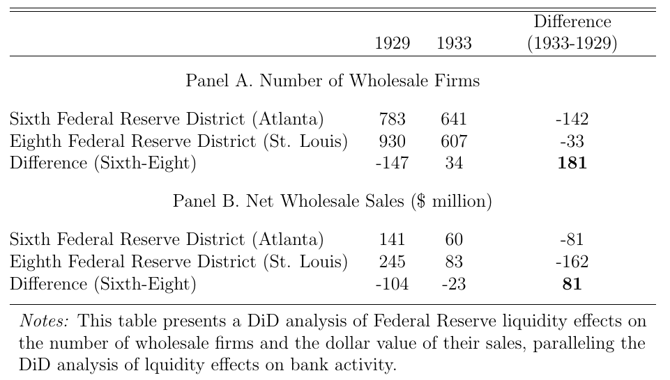
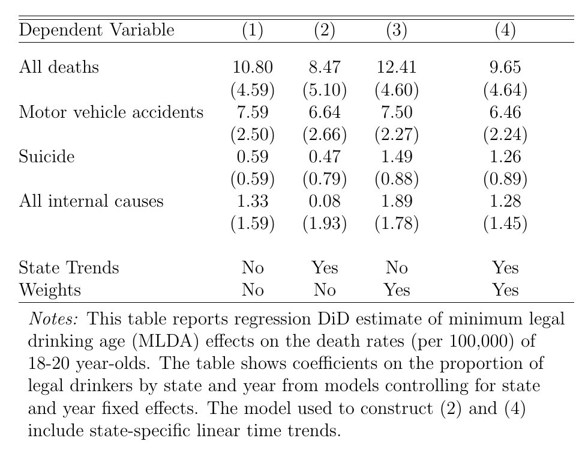
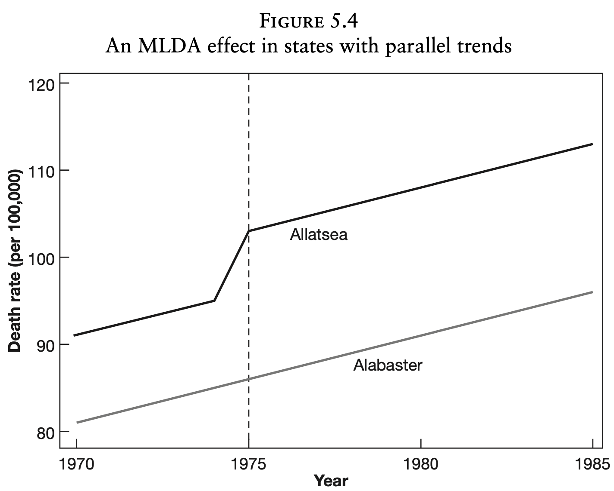
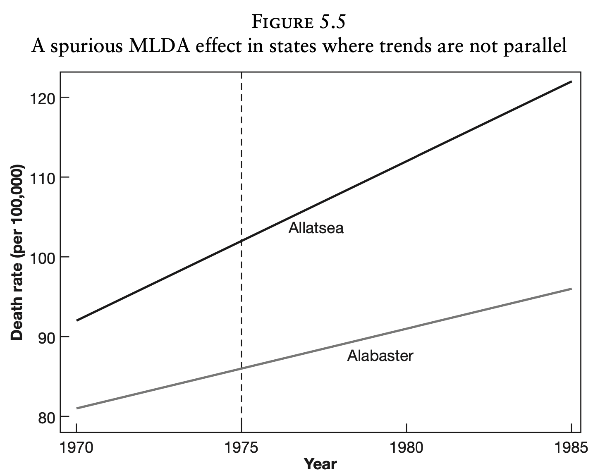

class: inverse, middle

```{r Setup, include = F}
options(htmltools.dir.version = FALSE)
knitr::opts_chunk$set(echo = TRUE, cache=TRUE)

library(pacman)
p_load(ggthemes, viridis, knitr, AER, extrafont, tidyverse, magrittr, wooldridge, stargazer, latex2exp, parallel, broom, kableExtra, ggforce, margins, furrr, gapminder)
# Define colors
red_pink <- "#e64173"
turquoise <- "#20B2AA"
orange <- "#FFA500"
red <- "#fb6107"
blue <- "#2b59c3"
green <- "#8bb174"
grey_light <- "grey70"
grey_mid <- "grey50"
grey_dark <- "grey20"
purple <- "#6A5ACD"
met_slate <- "#23373b" # metropolis font color
# Knitr options
opts_chunk$set(
  comment = "#>",
  fig.align = "center",
  fig.height = 7,
  fig.width = 10.5,
  #dpi = 300,
  #cache = T,
  warning = F,
  message = F
)  
theme_simple <- theme_bw() + theme(
  axis.line = element_line(color = met_slate),
  panel.grid = element_blank(),
  rect = element_blank(),
  strip.text = element_blank(),
  text = element_text(family = "Fira Sans", color = met_slate, size = 14),
  axis.text.x = element_text(size = 12),
  axis.text.y = element_text(size = 12),
  axis.ticks = element_blank(),
  plot.title = element_blank(),
  legend.position = "none"
)
theme_empty <- theme_bw() + theme(
  line = element_blank(),
  rect = element_blank(),
  strip.text = element_blank(),
  axis.text = element_blank(),
  plot.title = element_blank(),
  axis.title = element_blank(),
  plot.margin = structure(c(0, 0, -1, -1), unit = "lines", valid.unit = 3L, class = "unit"),
  legend.position = "none"
)
theme_axes <- theme_empty + theme(
  axis.title = element_text(size = 18),
  text = element_text(family = "Fira Sans", color = met_slate, size = 14),
  plot.margin = structure(c(0, 0, 0.1, 0), unit = "lines", valid.unit = 3L, class = "unit")
)
# Returns education data
wage2 <- get('wage2')
# MI school funding and test scores data
meap01 <- get('meap01') %>% 
  mutate(exppp = exppp/1000)
```

# Prologue

---
# Housekeeping

<br>

.hi-pink[Data Projects] are in!

- I will have those graded by the weekend

- Points based on the quality of submissions and presentation of results

--

.hi-pink[Problem Set 5]

- Due Monday, March 7th

---

# Model Specification

Concerns the following questions of a given model:

--

What are the consequences of including in the regression model a variable that should not be there?

--

.hi-pink[Multicollinearity]


--

What are the consequences of excluding a variable that should be featured?

--

.hi-pink[Omitted Variable Bias]
 
--
 
How do we test restrictions to model specifications?

--

.hi-pink[t and F tests]

---

# Model Specification

<br>
 
What happens if you have difficulty finding data on a variable and use a proxy instead?


.hi-pink[Today's lesson]

--

We will then go a useful approach to know for policy analysis: the .hi-pink[difference-in-difference] model


---
class: inverse, middle

# Proxies in Model Specifications

---
# Proxies

<br>

Suppose you are considering the following model
$$
\begin{aligned}
Y = \beta_0 + \beta_1 X_1 + \beta_2 X_2 + u
\end{aligned}
$$

While $X_1$ is observed, lets consider a case where $X_2$ is an unobserved variable. Cases of unobservable data could include:

- Vaguely defined with no explicit measure (e.g. quality of education)
- Intangible and cannot be quantified (e.g. utility, ability)
- Requires so much time/energy that measurement is infeasible
- Confidentiality, privacy concerns may limit observed data availability

---

# Proxies

<br>

Rather than exclude the unobservable, you may wish to use an adequate .hi-pink[proxy] variable for $X_2$.

--

A .hi-pink[proxy] variable is a substitute variable that may reasonably be supposed to maintain similar properties to our missing variable. 

--

.hi-blue[Example:] For quality of education, we could use the student-staff ratio to have a measure of how many resources the educational institution makes available to students. Where quality is high, student-staff ratios are low. 
 
---

# Proxies

<br>

Returning to the model, our true data generating process for Y:
$$
\begin{aligned}
Y = \beta_0 + \beta_1 X_1 + \beta_2 X_2 + u
\end{aligned}
$$

--

In the case where we have no data on $X_2$, suppose we have an .hi-blue[ideal proxy] for it such that there exists an *exact linear relationship $X_2$ and $Z$*:
$$
\begin{aligned}
X_2 = \lambda + \mu Z,
\end{aligned}
$$

where $\lambda$ and $\mu$ are fixed, unknown constants. We cannot estimate them by running a regression of the above relationship, since we have no data on $X_2$. .hi-pink[Let's sub in our expression and see what using Z achieves].

---

# Inference using Proxies

Using $X_2 = \lambda + \mu Z$,
$$
\begin{aligned}
Y = & \beta_0 + \beta_1 X_1 + \beta_2 X_2 + u\\
  = & \beta_0 + \beta_1 X_1 + \beta_2 (\lambda + \mu Z) + u\\
  = & (\beta_0 + \beta_2 \lambda) + \beta_1 X_1 + \beta_2 \mu Z + u\\
  = & \ \ \ \ \ \  \ \alpha \ \ \ \ \ \ \ \ \ + \beta_1 X_1 + \ \ \gamma_2 Z + u
\end{aligned}
$$

--

Takeaways:

1. $\beta_1$, its standard error and t-stat will be same as if $X_2$ used
1. $R^2$ will be the same as if $X_2$ was used instead of Z
1. The coefficient of Z, $\gamma_2$, will be estimate of $\beta_2 \mu$, and not possible to estimate $\beta_2$ directly
1. t-stat for $\gamma_1$ same as $\beta_2$, so able to assess significance of $X_2$
1. Not possible to estimate $\beta_0$ since we now only see $\alpha$


---

# Risks of using Proxies

Validity of all the subsequent takeaways rely on the condition that $Z$ is an ideal proxy for $X_2$

- In practice, unusual to find a proxy that is exactly linearly related to our missing variable

- If the relationship is close to linear, the results will hold **approximately**

-  The biggest problem faced is that there is never any manner by which to test this condition of whether the approximated difference is sufficiently small

- Critical thinking in explaining your logical link between $X_2$ & $Z$ and accepting that you are relying on a strong assumptions are often required to convince an audience that a proxy is indeed valid 

---
class: inverse, middle

# Difference-in-Difference (DiD)

---

# Non-Random Treatment

<br>

Previously we'd talked about binary categorical variables, known as dummies. An important application of .hi-pink[dummy variables] is to study the impact of a treatment. 

--

The estimation of treatment effects is important in a wide range of fields. 
.hi-blue[Examples:] 
* impact of cash transfers on child health
* effect of class size on student achievement

--

In clinical trials of health interventions, a common question is whether use of a medicine will improve health outcomes.

---

# Non-Random Treatment

Ideally treatment effects are evaluated using .hi-pink[randomized controlled trials].

--

If, for convenience, there is only one treatment level, for those treated, then this can be captured by a binary dummy variable, and a simple statistical model can be used:

$$Y_i = \beta_0 + \beta_1 D_i + u_i$$

--

for $i = 1, \dots, n,$ where $Di = 1$ if treated and $Di = 0$ if not treated, and
where $y_i$ is the outcome for individual $i$.

--

Random assignment: $D_i$ and $u_i$ are .hi-pink[independent (A3.)], and an
OLS regression will yield an .hi-pink[unbiased] estimate $\hat\beta_1$ of $\beta_1$. 
Our effect is the diff between mean outcomes for treated and untreated groups,
$\hat\beta_1 = \bar y_1 - \bar y_0$.
Also known as the .hi-blue[differences estimator].

---

# Non-Random Treatment

<br>

Often we are analyzing an intervention (or _treatment_) that takes place .hi-pink[over time], and we have data .hi-pink[both before and after] the treatment took place.

--


If the policy intervention affected everyone and we have data both in pre- and post-policy periods, might consider the .hi-blue[differences estimator]

> __Problem:__ Implicitly assumes that there are not other reasons for the
change in mean outcomes before and after the treatment

--

In this case the dummy variable $D_i$ in effect stands for the impact of .hi-pink[all factors], including the treatment, that are different between the pre- and post- periods.

---

# Non-Random Treatment

Since .hi-pink[other factors] may be partially responsible for the change in means, this estimator may be a biased estimate of the treatment effect. 

--

This point emphasizes importance of control group that does not receive the treatment. Occasionally policy changes have randomization built in .hi-blue[(randomized field experiments)].

--

> __Example:__ Oregon Health Plan (OHP) experiment of 2008. 
Oregon that year decided to expand coverage of its version of Medicaid to groups not previously eligible, but for reasons of expense this expanded coverage was rationed by a lottery: somewhat under half of those who registered were randomly selected and invited to apply for expanded coverage. It is then possible
to estimate the treatment effect on various outcomes by looking at differences
in the sample means of the two groups.


---

# DiD: Concept

In .hi-pink[most cases], this randomization aspect to policy change does not occur. Due to the paucity of randomized field experiments, applied econometricians have shown great interest in .hi-pink[natural experiments].

--

> __Setting:__ There is a discrete change in policy that affects only part of the population of interest, and that there are both pre- and post-treatment observations for both those who received treatment and those who did not.

--

Although the policy change occurs in a non-experimental setting, in some cases the change may be introduced in a way that makes it appear __as if__ the treatment was __randomly assigned__.

--

The .hi-pink[difference-in-difference (DiD)] method recognizes that in absence of random assignment, treatment and control groups are likely to differ for many reasons. 

---


# DiD: Structure

<br>

Suppose we have data on specific individuals $i = 1,\dots, n$ in each of two time periods $t = 1, 2$ that correspond to before and after the treatment was applied to some of the individuals. A simple statistical formulation of the model is then:

--

$$Y_{it} = \beta_0 + \beta_1 T_t + \beta_2 D_i + \beta_3 (T_t \times D_i) + u_{it}$$
for $i = 1,\dots,n,$ and $t = 1, 2$. (Note that we have $2n$ data points). 

--

Here $T_t = 1$ if $t = 2$ and $T_t = 0$ if $t = 1$, while $D_i = 1$ if individual $i$ receives treatment and $D_i = 0$ if individual $i$ does not receive treatment. 


---

# DiD: Structure

In the .hi-pink[pre-treatment period], $t = 1\implies T_t=0$, we have

$$E(y_{i1} | D_i = 0) = \beta_0 \text{ and } E(y_{i1} | D_i = 1) = \beta_0 + \beta_2$$

--

In the above specification, we are allowing for the possibility that in the quasi-experiment there was imperfect control, in the sense that those treated had different pre-treatment means than those not treated. 

--

In the .hi-pink[post-treatment period], $t = 2\implies T_t=1$, we have

$$E(y_{i2} | D_i = 0) = \beta_0 + \beta_1 \text{ and } E(y_{i2} | D_i = 1) = \beta_0 + \beta_1 + \beta_2 + \beta_3$$

--

The .hi-pink[treatment effect] corresponds to $\beta_3$: This is because
$$
\begin{aligned}
\text{Diff Post-Period:} & \ E(y_{i2} | D_i = 1) - E(y_{i2} | D_i = 0) = \beta_2 + \beta_3 \ \  \text{and}\\
\text{Diff Pre-Period:} & \ E(y_{i1} | D_i = 1) - E(y_{i1} | D_i = 0) = \beta_2
\end{aligned}
$$

---

# DiD: Example

_"Monetary Intervention in the Great Depression"_ by .hi-blue[Gary Richardson and William Troost (JPE, 2009)].

--

Consider the 1930s bank failures. Central Bank can prevent bank runs and bank failures by acting as lender of last resort to solvent banks.

--

The twelve different regional Federal Reserve Districts reacted in the 1930s to potential bank failures in different ways.

--

* Atlanta FRB (sixth district) and St Louis FRB (eighth district) followed radically different policies wrt bank runs & border between two regions runs East-West through the center of Mississippi

* Makes for a natural experiment, comparing outcomes for bank failures in Mississippi banks in the two districts

---

# DiD: Example

The .hi-blue[Sixth District policy] favored using the FRB lender of last resort role to lend to troubled banks, while .hi-blue[Eighth District policy] took the view that credit should be restricted in recessions. 

--

R&T analyze this using a .hi-pink[DiD approach].

```{r, echo=FALSE}
p_load(kableExtra)

df_bank = tibble(Variable = c("No. of Banks open 1930", 
                    "No. of Banks open 1931", 
                    "Changes in banks open"),
       dist_8 = c(165, 132, -33),
       dist_6 = c(135, 121, -14),
       diff   = c(-30, -11,  19)) %>%
  kbl(caption = "Bank Losses by Policy",
      col.names = c("Variable",
                    "8th District",
                    "6th District",
                    "Diff., 6th-8th")) %>%
  kable_classic(full_width = F, html_font = "Cambria")

df_bank

```

Estimated to have saved 19 banks, 14% of Sixth District in 1930.

---

# DiD: Required Assumption

A central question in assessing quasi-experiments is the .hi-pink[validity] of the control group, so that the treatment is really _as if_ it was randomly assigned.

A key issue is the implicit .hi-pink[common trends] assumption: in the
absence of the _"treatment"_, would the number of open banks in the two
districts have been expected to evolve in the same way?

```{r, out.width="60%", echo=FALSE}

```


---

# DiD: Interpretation

.hi-pink[DiD Model Results]

One can use this data to get an estimate of the treatment effect $\hat\beta_3$ and a standard error $SE(\hat\beta_3)$ for the effect based on these twelve data points:

$$
\begin{aligned}
Y_{dt} = 167 - 49 T_t - 29 D_d  + 20.5(T_t \times D_d) + u_{dt}
\end{aligned}
$$

Here $T_t$ is coded 1 for 1931 or later, and $D_d=1$ for the 6th District. 
With a t-score of 1.9 and using a two-tailed test, significant at 10% level. 

This is about the most evidence one could hope for with twelve data points.

---

# DiD: Interpretation


```{r, echo=FALSE}
p_load(lubridate)
devtools::install_github("jrnold/masteringmetrics", subdir = "masteringmetrics")

data("banks", package="masteringmetrics")

# Only use yearly data in the DiD. Use # of banks on July 1st of each year. 
banks <- banks %>% 
  filter( month(date) == 7L, mday(date) == 1L) %>%
  mutate(year = year(date)) %>%
  select(year, matches("bi[ob][68]"))

# Generate the counterfactual using the difference between the number of banks in district 8 and district 6.
banks <- banks %>% 
  arrange(year) %>%
  mutate(diff86 = bib8[year == 1930] - bib6[year == 1930],
          counterfactual = if_else( year >= 1930, bib8 - diff86, NA_integer_)) %>% 
  select(-diff86)

```

```{r, plot-banks, echo=FALSE, out.width="90%"}
select(banks, year, bib8, bib6, counterfactual) %>%
  gather(variable, value, -year, na.rm=TRUE) %>% 
  mutate(variable = recode(variable, bib8 = "8th district",
                           bib6 = "6th district", 
                           counterfactual = "6th Counterfactual")) %>%
  ggplot(aes(x=year, y=value, color=variable))+
  geom_point()+
  geom_line(size=1)+
  ylab("Number of Banks in Business")+
  xlab("")+
  theme_bw()+
  theme(legend.title = element_blank(),
        legend.position = "bottom",
        legend.text = element_text(size=14),
        axis.text.y = element_text(size=14),
        axis.text.x = element_text(size=14))

```

--


Let's do the same .hi-pink[DiD] with other outcome variables!

---

# DiD: Interpretation

```{r, echo=FALSE, out.width="90%"}

```
--

# DiD 

This .hi-pink[policy change] seems to have prevented a harsher impact on existing firms, when assessing sales performance and numbers of firms.

---

class: inverse, middle

# DiD: MLDA Laws

---

# MLDA Laws

This DiD estimates MLDA-induced deaths among 18-20 year olds, from 1970-1983.

--

**1933:** End of the federal alcohol Prohibition. Most states regulated the .hi-pink[Minimum Legal Drinking Age] to 21. However, some states including Kansas, New York and North Carolina maintained a drinking age of 18. 

--

**1971:** Voting ages were reduced to 18, and many states coincided this policy change of MLDA to 18. Arkansas, California, and Pennsylvania are among states that kept MLDA at 21. 

--

**1984:** National Minimum Drinking Age Act punished states set to 18 by withholding federal highway construction aid. 

--

.hi-blue[What happened between 1970 and 1984 when drinking age was reduced?]


---

# MLDA: DiD model

<br>

.hi-blue[Dependent variable:] death rates of 18-20 year olds in state $s$ and year $t$. For simplicity, sample includes only Alabama (treated) and Arkansas (control). 

--

$$Y_{st} = \beta_0 + \beta_1 \text{D}_s + \beta_2 \text{T}_t + \beta_3 (D_s \times T_t) + u_{st},$$

--

where $D_s$ indicates whether a given state is Alabama, and $T_t$ is a post-period dummy for whether observations are from 1975 onward when Alabama introduced an MLDA of 19. 

--

.hi-pink[Key Assumption:] Pre-policy (prior to 1975), Alabama and Arkansas shared parallel trends in their death rates of 18-20 year olds. 

---

# MLDA: DiD model

What about the other states? Would we not want to use more observations?
Ideally, yes, but this will introduce further econometric challenges.

--

* States did not all lower to 18 at the same time, meaning there is no common post-treatment  period.

* Unobservable differences exist across states, constant across time. 

* Absense of a common treatment variable in a multi-state setting, since states chose ages of 18,19 and 20. 

--

To solve for these issues, use .hi-blue[year dummies], .hi-blue[state fixed effects], and replace $T_t \times D_d$ with a .hi-blue[common treatment variable], $LEGAL_{st}$, which measures the proportion of 18-20 year-olds allowed to drink in state $s$ and year $t$. 

---

# MLDA: DiD model

<br>

The .hi-blue[multistate regression] DiD model looks like:

$$Y_{st} = \alpha_0 + \alpha_1 LEGAL_{st} + \sum_{k=\text{Alaska}}^{\text{Wyoming}} \alpha_k \text{State}_{ks} +\sum_{j=\text{1971}}^{\text{1983}} \alpha_j \text{Year}_{jt} + \nu_{st},$$

where now we are using state and year dummies to capture fixed effects, which uses Alabama as our reference state and 1970 as our reference year.

--

.hi-blue[State-Year Panel Data:] Including District of Col. we have 51 "states" and 14 years, giving us 714 observations. 

--

Regression results suggest that there was a significant increase in deaths, largely attributed to motor vehicle accidents.

---

# MLDA: Results

```{r, echo=FALSE, out.width="90%"}

```

---

# MLDA: Assumptions

The inclusion of many states and many years of observations allows us to relax the .hi-pink[common trends] assumption. 

Including .hi-blue[state trends] violates this assumption, by allowing for a degree of non-parallel evolution in outcomes between state in the absense of a treatment effect. 

--

With state trends factored in:

$$
\begin{aligned}
Y_{st} =& \alpha_0 + \alpha_1 LEGAL_{st} + \sum_{k=\text{Alaska}}^{\text{Wyoming}} \alpha_k \text{State}_{ks} +\sum_{j=\text{1971}}^{\text{1983}} \alpha_j \text{Year}_{jt}\\
& \sum_{k=\text{Alaska}}^{\text{Wyoming}} \theta_k (\text{State}_{ks} \times t)+ \varepsilon_{st},
\end{aligned}
$$

.hi-blue[What does this allow us to address?]

---

```{r, echo=FALSE, eval=FALSE}
# For those interested in generating these results, I've left in some code that won't appear in the slides. This is originally prepared by Jeffrey B. Arnold

# LINK: https://jrnold.github.io/masteringmetrics/mlda-difference-in-difference.html

p_load(haven, rlang, broom, clubSandwich)
data("deaths", package = "masteringmetrics")

deaths <- mutate(deaths, year_fct = factor(year))

# Regression DD Estimates of MLDA-Induced Deaths among 18-20 year-olds, from 1970-1983

dtypes <- c("all" = "All deaths",
            "MVA" = "Motor vehicle accidents",
            "suicide" = "Suicide",
            "internal" = "All internal causes")

# Estimate the DD for MLDA for all causes of death in 18-20 year olds. Run the regression with lm and calculate the cluster robust standard errors using sandwich::vcovCL. Subset the data.

data <- filter(deaths, year <= 1983, agegr == "18-20 yrs", dtype == "all")


mod <- lm(mrate ~ 0 + legal + state + year_fct, data = data)

# Calculate cluster robust coefficients. These are calculated using a different method than Stata uses, and thus will be slightly different than those reported in the book.

vcov <- vcovCR(mod, cluster = data[["state"]],
               type = "CR2")
coef_test(mod, vcov = vcov) %>%
  rownames_to_column(var = "term") %>%
  as_tibble() %>%
  select(term, estimate = beta, std.error = SE) %>%
  filter(term == "legal") %>%
  knitr::kable(digits = 2)

# Function to calculate clustered standard errors and return a tidy data frame of the coefficients and standard errors.

cluster_se <- function(mod, cluster, type = "CR2") {
  vcov <- vcovCR(mod, cluster = cluster, type = "CR2")
  coef_test(mod, vcov = vcov) %>%
    rownames_to_column(var = "term") %>%
    as_tibble() %>%
    select(term, estimate = beta, std.error = SE)
}

run_mlda_dd <- function(i) {
  data <- filter(deaths, year <= 1983, agegr == "18-20 yrs", dtype == i) # nolint
  mods <- tribble(
    ~ name, ~ model,
    "No trends, no weights",
    lm(mrate ~ 0 + legal + state + year_fct, data = data),
    "Time trends, no weights",
    lm(mrate ~ 0 + legal + year_fct + state + state:year, data = data),
    "No trends, weights",
    lm(mrate ~ 0 + legal + year_fct + state, data = data, weights = pop),
    # nolint start
    # "Time trends, weights",
    #   lm(mrate ~ 0 + legal + year_fct + state + state:year,
    #      data = data, weights = pop)
    # nolint end
  ) %>%
    mutate(coefs = map(model, ~ cluster_se(.x, cluster = data[["state"]],
                                           type = "CR2"))) %>%
    unnest(coefs) %>%
    filter(term == "legal") %>%
    mutate(response = i) %>%
    select(name, response, estimate, std.error)
}

mlda_dd <- map_df(names(dtypes), run_mlda_dd)

mlda_dd %>%
  knitr::kable(digits = 3)

```

# MLDA: Assumptions

```{r, echo=FALSE, out.width="80%"}

```

---

# MLDA: Assumptions

```{r, echo=FALSE, out.width="80%"}

```


---

# MLDA: Assumptions

```{r, echo=FALSE, out.width="80%"}
knitr::include_graphics("fig5_6.png")
```


---

exclude: true

```{R generate pdfs, include = F, eval = F}
#remotes::install_github('rstudio/pagedown')
library(pagedown)
pagedown::chrome_print("15-Model-Spec.html", output = "15-Model-Spec.pdf")
```
