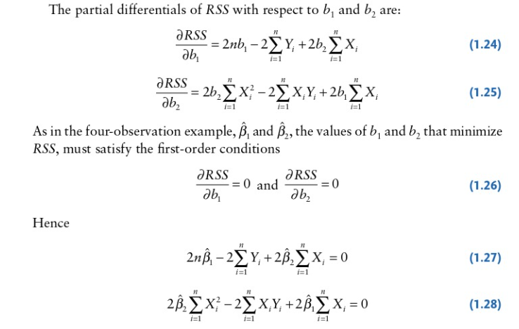

class: inverse, middle

```{r Setup, include = F}
options(htmltools.dir.version = FALSE)
library(pacman)
p_load(ggthemes, viridis, knitr, extrafont, tidyverse, magrittr, wooldridge, stargazer, latex2exp, parallel, broom, wooldridge, readxl, jtools, huxtable)
# Define colors
red_pink <- "#e64173"
met_slate <- "#23373b" # metropolis font color
# Knitr options
opts_chunk$set(
  comment = "#>",
  fig.align = "center",
  fig.height = 7,
  fig.width = 10.5,
  #dpi = 300,
  #cache = T,
  warning = F,
  message = F
)  
theme_simple <- theme_bw() + theme(
  axis.line = element_line(color = met_slate),
  panel.grid = element_blank(),
  rect = element_blank(),
  strip.text = element_blank(),
  text = element_text(family = "Fira Sans", color = met_slate, size = 14),
  axis.text.x = element_text(size = 12),
  axis.text.y = element_text(size = 12),
  axis.ticks = element_blank(),
  plot.title = element_blank(),
  legend.position = "none"
)
theme_empty <- theme_bw() + theme(
  line = element_blank(),
  rect = element_blank(),
  strip.text = element_blank(),
  axis.text = element_blank(),
  plot.title = element_blank(),
  axis.title = element_blank(),
  plot.margin = structure(c(0, 0, -1, -1), unit = "lines", valid.unit = 3L, class = "unit"),
  legend.position = "none"
)

```

# Prologue

---

# PBS3 Q3

**Second proof:**

$$
\begin{aligned}
&\text{Supporting Proof}\\
\sum_{i=1}^n X_i \hat{u_i}  = & \sum_{i=1}^n X_i (Y_i - \hat{\beta_1} - \hat{\beta_2}X_i) = \sum_{i=1}^n X_i Y_i - \hat{\beta_1} \sum_{i=1}^n X_i -  \hat{\beta_2}\sum_{i=1}^n X_i^2 = 0\\
&\\
&\\
&\text{Main Proof}\\
\text{cov}(X,u) = & E[(X_i - \bar{X})(\hat{u_i}-\bar{ \hat{u_i}})] \\
=& \frac{1}{n}\sum_{i=1}^n(X_i - \bar{X})(\hat{u_i}-\bar{ \hat{u_i}}) =\frac{1}{n}\sum_{i=1}^n(X_i - \bar{X})\hat{u_i}\\
=& \frac{1}{n}\sum_{i=1}^n(X_i \hat{u_i})  - \frac{1}{n}\sum_{i=1}^n(\bar{X}\hat{u_i}) =  0 + \bar{X}\frac{1}{n}\sum_{i=1}^n \hat{u_i} = 0
\end{aligned}
$$

---

# PBS3 Q3

Why does $\sum_{i=1}^n X_i Y_i - \hat{\beta_1} \sum_{i=1}^n X_i -  \hat{\beta_2}\sum_{i=1}^n X_i^2 = 0$ hold?

--

.hi-pink[Dougherty (5th ed), p.93]

--

```{r, out.width="70%", echo=FALSE}

```


---

# Exam Structure

.hi-pink[Section 1:] **Multiple Choice Qs (20)**

- 10 questions, each worth 2pts

- No negative grading, no attempt marks

--

.hi-pink[Section 2:] **Short Answer Qs (20)**

- 3 questions with multiple parts

--

.hi-pink[Section 3:] **Long Answer Qs (30 each)**

- 3 questions with multiple parts

- Attempt 2 of the choices, each devoted to a particular topic

--

.hi-pink[Know your proofs] from homework and detailed in slides

---

# Exam Logistics

<br>

This Wednesday at **4pm SHARP**

-  Lectures up to and including .hi-pink[Classical Assumptions]

- .hi-pink[110 minutes] (1hr 50 minutes), .hi-pink[arrive early]

- Seat yourself distant from others

--

- Bring calculators and writing utensils

- I will provide scrap paper and calculators for those in need

--

**Any questions?**

---

# Current Performance

```{r, echo=FALSE}
scores <- read_excel("C:/Users/phili/Downloads/2022-02-05T1042_Grades-EC_320.xlsx")
pre_mid <- scores %>% mutate(`Final Score` = as.numeric(`Final Score`)) %>%
  filter(`Final Score` >0 )


ggplot(pre_mid) + ggtitle("Scores Distribution") +
  geom_density(aes(x=`Final Score`), fill="blue", alpha=0.3) +
  xlab("Current %")+
  theme_pander()
  

```

---

# Current Performance

```{r time-hours, echo=FALSE}
pre_mid <- pre_mid %>% mutate(time = hour + min/60 + sec/(60*60))


ggplot(pre_mid) + ggtitle("Canvas Time Distribution") +
  geom_density(aes(x=time), fill="pink", alpha=0.3) +
  xlab("Hours")+
  theme_pander()
  

```

---

# Current Performance

```{r, echo=FALSE, message=FALSE}

ggplot(pre_mid, aes(x=time,y=`Final Score`)) +
  geom_point() +
  ylab("Current Score") + xlab("Time Spent on Canvas") +
  scale_y_continuous(expand=c(0,0), limits=c(0, 110)) +
  ggtitle("Co-movement of these variables") +
  theme_pander()
  

```


---

# Current Performance

```{r, echo=FALSE, out.width="20%"}

pre_mid <- pre_mid %>% rename(score = `Final Score` )
res <- lm(data=pre_mid, score ~ time)

#export_summs(res, model.names = "Dep: Score")
#stargazer(res, type="html")

```

<table style="text-align:center">
<tr><td style="text-align:left"></td><td>score</td></tr>
<tr><td colspan="2" style="border-bottom: 1px solid black"></td></tr><tr><td style="text-align:left">canvas time</td><td>0.502</td></tr>
<tr><td style="text-align:left"></td><td>(0.453)</td></tr>
<tr><td colspan="2" style="border-bottom: 1px solid black"></td></tr><tr><td style="text-align:left">n</td><td>20</td></tr>
<tr><td style="text-align:left">R<sup>2</sup></td><td>0.064</td></tr>
</table>

--

Could there be bias in these results?

--

**Yes**: Not controlling for unobserved textbook time, unobserved R time, unobserved homework practice, office hours usage, emails or unobserved ability.

---

exclude: true

```{R generate pdfs, include = F, eval = F}
#remotes::install_github('rstudio/pagedown')
library(pagedown)
pagedown::chrome_print("Midterm-Review.html", output = "Midterm-Review.pdf")
```